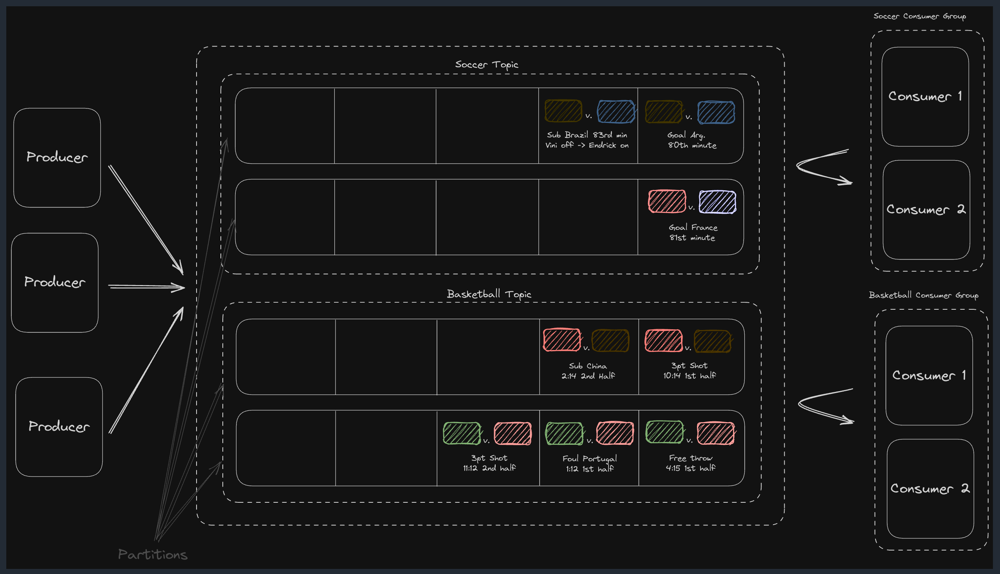

# Kafka for System Design — 5-Minute Revision

**What it is:** Open-source distributed event streaming platform. Works as a **message queue** or a **stream**. Optimized for high throughput, scalability, durability. Motto: *"always available, sometimes consistent."*

## Core Architecture & Terminology

- **Cluster** = multiple **brokers** (servers storing data + serving clients). More brokers = more capacity + fault tolerance.
- **Topic** = logical grouping of messages (what you publish/subscribe to). Multi-producer.
- **Partition** = physical, ordered, immutable, append-only log (like a commit log). This is how Kafka scales and parallelizes. A topic has many partitions, spread across brokers.
- **Offset** = sequential ID of a message within a partition. Consumers track progress via committed offsets.
- **Producer** writes to topics; **Consumer** reads from topics (Kafka doesn't care about payload contents).
- **Consumer Group** = each partition assigned to exactly one consumer in the group → each message processed once per group. Multiple groups can independently read the same topic (stream mode).

**Topic vs partition:** topic = logical organization; partition = physical unit of scaling/parallelism.

*Producers write to topics (Soccer / Basketball); each topic splits into partitions; each topic has its own consumer group, with partitions divided among consumers in the group.*

## How It Works (message flow)

1. **Message/record** = value + key + timestamp + headers (all technically optional).
2. **Partition selection:** `partition = hash(key) % num_partitions` (murmur2 hash by default). Same key → same partition → **ordering preserved per partition**. No key → sticky/round-robin distribution (loses ordering guarantee).
3. **Broker assignment:** cluster metadata (managed by the **controller**) maps partition → broker.
4. **Replication (leader-follower):** each partition has 1 leader (handles reads/writes) + N followers (passive replicas on other brokers). Followers sync from leader; on leader failure, an **in-sync replica (ISR)** is promoted. Controller manages this.
5. **Consumers pull** (poll) — not push. Lets them control consumption rate, batch, and avoids overwhelming slow consumers.

**Delivery:** at-least-once by default (crash before offset commit → reprocessing). Exactly-once needs idempotent producers + transactional APIs.

## When to Use (interview signals)

**Queue** when: async processing (e.g., YouTube transcode after upload), ordering needed (e.g., Ticketmaster waiting queue), decoupling producer/consumer for independent scaling.

**Stream** when: continuous real-time processing (e.g., Ad Click Aggregator), multiple consumer groups reading same data (e.g., FB Live Comments pub/sub), replay needed.

## Scalability

- **Single broker ballpark:** ~1TB storage, ~1M msgs/sec. Message size: keep **under 1MB** (`message.max.bytes` configurable).
- **Anti-pattern:** don't store large blobs (videos, files) in Kafka. Store in S3, put a *pointer* in Kafka.
- **Scaling strategies:**
  - **More brokers** — but only helps if topics have **enough partitions** (under-partitioning wastes new brokers).
  - **Partitioning strategy** — the main lever in interviews. Good key = evenly distributed. Bad key = **hot partitions**.

**Hot partition fixes** (common interview Q): no key / default partitioner (lose ordering), random **salting** of key, **compound key** (e.g., adId + region/userId), or **back pressure** (slow producer based on lag).

## Fault Tolerance & Durability

- **Replication factor** (commonly 3 = 1 leader + 2 followers). Survives broker loss.
- **`acks=all`** → message acknowledged only when all ISRs receive it = strongest durability.
- **Consumer failure:** offset commits let it resume from last committed offset; **rebalancing** redistributes partitions among remaining consumers.
- **Offset commit timing trade-off:** commit *after* work is safely done (e.g., HTML stored in S3), else risk losing work. Keep consumer work small to minimize reprocessing (e.g., Web Crawler split into download → parse phases).

## Retries & Errors

- **Producer:** built-in automatic retries. Enable **idempotent mode** to avoid duplicates on retry.
- **Consumer:** *no built-in retries* (SQS has them). Roll your own: **retry topic** → after N failures → **dead letter queue (DLQ)**. (Web Crawler design picks SQS over Kafka for this reason.)

## Performance Optimizations

- **Batch** messages (`send()` / `sendBatch()`) — producers batch naturally.
- **Compress** (GZIP, Snappy, LZ4).
- **Partition key choice** = biggest lever (maximize even distribution / parallelism).

## Retention

- Configured via `retention.ms` / `retention.bytes`. **Default: 7 days.** Can extend for replay/storage needs — watch cost + performance.

---

**Interview opener reflex:** estimate throughput & message volume first → decide if scaling is even needed → then lead with **partitioning strategy** and **hot partition handling**.