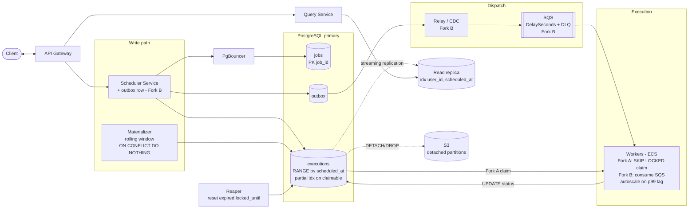

# Distributed Job Scheduler (Postgres) — System Design Revision

> Same problem as the DynamoDB doc, re-architected around **PostgreSQL**. Take jobs (task + schedule + params) and execute them **within 2s of their scheduled time**, at **10k jobs/sec**, **at-least-once**, favoring **availability over consistency**.
>
> **Why this version exists:** many interviewers ban managed NoSQL / managed queues ("build it with open-source"). Postgres changes the data model (real relational DDL), the dispatch mechanism (`SELECT … FOR UPDATE SKIP LOCKED`), and the scaling story (partitioning, connection pooling, VACUUM/bloat, Citus). It is **not** a find-and-replace of the DynamoDB design.

---

## 1. Requirements

### Functional
- Schedule jobs for **immediate**, **future**, or **recurring** (CRON) execution.
- Users can **monitor job status**.
- *(Out of scope: cancel / reschedule.)*

### Non-Functional
- **Availability > Consistency.**
- Execute within **2s** of scheduled time.
- Scale to **10k jobs/sec**.
- **At-least-once** execution.
- *(Out of scope: security policies, CI/CD.)*

### Back-of-envelope
| Metric | Value |
|---|---|
| Throughput | 10k jobs/sec |
| Status writes/sec | ~10–20k (each job → IN_PROGRESS + COMPLETED) |
| Postgres pain point | not a per-partition WCU cap — it's **single-writer throughput + UPDATE churn (bloat/VACUUM) + connection count** |
| Rows/day | ~864M executions/day at steady 10k/s → **time-partition + archive aggressively** |

---

## 2. Core Entities

- **Task** — abstract, reusable unit of work ("send an email").
- **Job** — a task instance with a schedule + params.
- **Schedule** — `CRON` (recurring) or `DATE` (one-time).
- **User** — owns jobs, queries status.

**Same key insight as before:** separate the **job definition** (`jobs`) from its **execution instances** (`executions`). One recurring definition → many concrete occurrence rows.

---

## 3. API

### Create a job
```http
POST /jobs
Content-Type: application/json

{
  "task_id": "send_email",
  "schedule": { "type": "CRON", "expression": "0 10 * * *" },
  "parameters": { "to": "john@example.com", "subject": "Daily Report" }
}
```
```json
// 201 Created
{ "job_id": "123e4567-e89b-12d3-a456-426614174000", "status": "SCHEDULED" }
```

### Query job status
```http
GET /jobs?user_id=user_123&status=PENDING&start_time=...&end_time=...
```
```json
// 200 OK — served from a read replica via the (user_id, scheduled_at) index
{
  "executions": [
    { "job_id": "123e4567-...", "scheduled_at": 1715548800, "status": "COMPLETED", "attempt": 0 }
  ],
  "next_cursor": "eyJzY2hlZHVsZWRfYXQiOi4uLn0="
}
```

> Writes go to the **primary**; status reads go to **read replicas** (keyset pagination on `scheduled_at`). Replica lag → possibly stale status, acceptable under availability > consistency (state it out loud).

---

## 4. Data Model (Postgres) — the part interviewers grade hardest

### 4.1 `jobs` — definitions (stable, low churn)
```sql
CREATE TABLE jobs (
    job_id        UUID PRIMARY KEY DEFAULT gen_random_uuid(),
    user_id       UUID NOT NULL,
    task_id       TEXT NOT NULL,
    schedule_type TEXT NOT NULL CHECK (schedule_type IN ('CRON','DATE')),
    schedule_expr TEXT NOT NULL,                 -- '0 10 * * *' or an ISO datetime
    parameters    JSONB NOT NULL DEFAULT '{}',
    created_at    TIMESTAMPTZ NOT NULL DEFAULT now()
);

CREATE INDEX idx_jobs_user ON jobs (user_id);
-- lets the materializer scan only recurring definitions
CREATE INDEX idx_jobs_cron ON jobs (job_id) WHERE schedule_type = 'CRON';
```
Access pattern: **point lookup by `job_id`**, plus a materializer scan over CRON rows.

### 4.2 `executions` — instances (HIGH churn) — **range-partitioned by time**
```sql
CREATE TABLE executions (
    execution_id BIGINT GENERATED ALWAYS AS IDENTITY,
    job_id       UUID NOT NULL,
    user_id      UUID NOT NULL,
    scheduled_at TIMESTAMPTZ NOT NULL,
    status       TEXT NOT NULL DEFAULT 'PENDING'
                 CHECK (status IN ('PENDING','ENQUEUED','IN_PROGRESS',
                                   'COMPLETED','FAILED','RETRYING')),
    attempt      INT NOT NULL DEFAULT 0,
    locked_by    TEXT,            -- worker holding the lease (visibility-timeout equivalent)
    locked_until TIMESTAMPTZ,     -- lease expiry; reaper reclaims after this
    next_run_at  TIMESTAMPTZ,     -- backoff target for retries
    PRIMARY KEY (execution_id, scheduled_at),          -- partition col must be in the PK
    UNIQUE (job_id, scheduled_at)                       -- makes materialization idempotent
) PARTITION BY RANGE (scheduled_at);

-- one partition per day (hourly if volume demands). Pre-create ahead of time.
CREATE TABLE executions_2026_08_26 PARTITION OF executions
    FOR VALUES FROM ('2026-08-26') TO ('2026-08-27');
```

**Why partition by `scheduled_at`?** It replaces DynamoDB's `time_bucket` sharding:
- **Partition pruning:** "due soon" queries touch only today's (and maybe tomorrow's) partition, not 864M rows.
- **O(1) archival:** `DETACH`/`DROP` an old partition instead of a giant `DELETE` (no VACUUM storm). Detached partitions → S3/cold store.
- **Bloat is localized:** high-churn UPDATEs concentrate in the current partition; old partitions stay read-only and tight.

### 4.3 The workhorse index — partial index on claimable rows
```sql
-- Tiny index: only rows a worker might claim. Keeps the hot path fast.
CREATE INDEX idx_exec_due ON executions (scheduled_at)
    WHERE status IN ('PENDING','RETRYING');
```
This is the Postgres equivalent of "cheap due-soon reads." Because it's **partial**, its size tracks the pending backlog, not total history.

### 4.4 The "GSI" — per-user status queries
```sql
-- regular secondary index; the read path lives on replicas
CREATE INDEX idx_exec_user ON executions (user_id, scheduled_at);
```
Unlike a DynamoDB GSI there's no separate replicated table, but the index **still costs on every write** and can bloat under churn — same spirit of tradeoff, different mechanism.

### 4.5 Example data

`jobs`:
```json
{
  "job_id": "123e4567-e89b-12d3-a456-426614174000",
  "user_id": "user_123",
  "task_id": "send_email",
  "schedule_type": "CRON",
  "schedule_expr": "0 10 * * *",
  "parameters": { "to": "john@example.com", "subject": "Daily Report" },
  "created_at": "2026-08-26T09:00:00Z"
}
```

`executions` (one materialized occurrence, mid-flight):
```json
{
  "execution_id": 90271833,
  "job_id": "123e4567-e89b-12d3-a456-426614174000",
  "user_id": "user_123",
  "scheduled_at": "2026-08-27T10:00:00Z",
  "status": "IN_PROGRESS",
  "attempt": 0,
  "locked_by": "worker-7a1c",
  "locked_until": "2026-08-27T10:00:30Z",
  "next_run_at": null
}
```

### 4.6 The core queries (know these cold)

**Claim due jobs — `FOR UPDATE SKIP LOCKED` (the heart of the design):**
```sql
WITH claimed AS (
  SELECT execution_id, scheduled_at
  FROM executions
  WHERE status IN ('PENDING','RETRYING')
    AND scheduled_at <= now() + interval '5 minutes'
  ORDER BY scheduled_at
  FOR UPDATE SKIP LOCKED          -- concurrent workers never block each other
  LIMIT 100                       -- batch claim
)
UPDATE executions e
SET status = 'IN_PROGRESS',
    locked_by = $worker_id,
    locked_until = now() + interval '30 seconds'
FROM claimed c
WHERE e.execution_id = c.execution_id AND e.scheduled_at = c.scheduled_at
RETURNING e.*;
```
`SKIP LOCKED` lets N workers pull disjoint batches concurrently without lock contention — this is why Postgres makes a competent queue.

**Reaper — reclaim leases from dead workers (visibility-timeout equivalent):**
```sql
UPDATE executions
SET status = 'PENDING', locked_by = NULL, locked_until = NULL
WHERE status = 'IN_PROGRESS' AND locked_until < now();
```

**User status query (read replica, keyset pagination):**
```sql
SELECT job_id, scheduled_at, status, attempt
FROM executions
WHERE user_id = $1 AND status = $2
  AND scheduled_at BETWEEN $3 AND $4
ORDER BY scheduled_at DESC
LIMIT 50;
```

**Idempotent materialization of the next occurrence:**
```sql
INSERT INTO executions (job_id, user_id, scheduled_at, status)
VALUES ($1, $2, $3, 'PENDING')
ON CONFLICT (job_id, scheduled_at) DO NOTHING;   -- safe to re-run
```

---

## 5. High-Level Architecture

Two legitimate forks — pick based on scale and whether managed services are allowed.

### Fork A — Postgres *as the queue* (no SQS) — simplest, "no managed services"
```
client → API Gateway → Scheduler Service → Postgres (jobs + executions)
Materializer → executions (rolling window)
Worker pool → SELECT … FOR UPDATE SKIP LOCKED → execute → UPDATE status
Reaper → resets expired leases
(LISTEN/NOTIFY optionally wakes workers for near-term inserts)
```
Fewer moving parts, transactional enqueue, no dual-write. Ceiling is the single primary; precision under herd is harder because you're polling.

### Fork B — Postgres + SQS via **transactional outbox** — for full 10k/s + tight precision
```
Scheduler writes job + outbox row in ONE transaction
Relay (poller / Debezium CDC) reads outbox → publishes to SQS with DelaySeconds
Workers consume SQS (visibility timeout + heartbeat + DLQ) → execute → UPDATE status in Postgres
```
The **outbox** solves the dual-write problem (DB and queue can't be updated atomically otherwise). This mirrors the DynamoDB doc's two-layer scheduler while keeping Postgres as the source of truth.

### Data flow (Fork A)
1. Create job → `INSERT` into `jobs`; if one-time, also `INSERT` an `executions` row (`PENDING`).
2. **Materializer** keeps `executions` populated for a rolling window (recurring jobs).
3. **Workers** run the `SKIP LOCKED` claim loop for rows due soon, set `IN_PROGRESS` + lease.
4. Execute; on success `UPDATE status='COMPLETED'`; on failure bump `attempt`, set `next_run_at` (backoff).
5. **Reaper** resets rows whose `locked_until` elapsed → at-least-once.

---

## 6. Key Decisions — Best / Alternate / Tradeoff

| # | Decision | Best | Alternate | Why / Tradeoff |
|---|---|---|---|---|
| 1 | **Database** | **Postgres** — SQL, rich indexing, `SKIP LOCKED`, transactions, partitioning | DynamoDB/Cassandra | Postgres gives transactional queueing + flexible queries; you own horizontal write scaling. |
| 2 | **Dispatch / queue** | **`FOR UPDATE SKIP LOCKED`** claim loop | Poll + external queue | Idiomatic Postgres queue; no extra infra. Contention manageable with batching + partitioning. |
| 3 | **2s precision** | Poll due-soon via partial index; **LISTEN/NOTIFY** for near-term wakeups | Fixed-interval cron only | NOTIFY cuts latency for just-inserted jobs; not durable, so it's an optimization, not correctness. |
| 4 | **Delayed precision at 10k/s** | **Postgres + SQS via outbox** (Fork B) | Pure Postgres (Fork A) | SQS `DelaySeconds` + visibility gives clean delayed delivery + failure handling; outbox avoids dual-write. |
| 5 | **Hot data / archival** | **Range partition by `scheduled_at`**; `DETACH`/`DROP` old → S3 | `DELETE` old rows | Partition pruning speeds reads; drop-partition avoids VACUUM storms from mass deletes. |
| 6 | **Connections** | **PgBouncer** (transaction pooling), bounded worker pools | Direct connections | Postgres is process-per-connection; 10k/s w/ many workers exhausts it without a pooler. |
| 7 | **Read scaling** | **Read replicas** for the status/query path | Serve reads from primary | Offloads the primary; accept replica lag (availability > consistency). |
| 8 | **Horizontal write scale** | **Citus** (distribute by `job_id`/`user_id`) or app-level sharding | Vertical scale only | Single primary caps you; shard when one box + partitioning isn't enough. |
| 9 | **Worker compute** | Containers (ECS/K8s), autoscale on p99 lag | Lambda | Steady high volume → containers cheaper, no cold-start risk vs 2s SLA. |
| 10 | **Invisible failure** | **Lease columns (`locked_until`) + reaper**, or SQS visibility (Fork B) | DB advisory locks only | Lease + reaper = simple, durable at-least-once; advisory locks vanish on disconnect but are session-scoped. |

---

## 7. Deep Dives

### 7.1 Precision (within 2s)
- Partial index (`idx_exec_due`) makes the claim query cheap even as history grows.
- **LISTEN/NOTIFY**: on inserting a near-term job, `NOTIFY` a channel so idle workers wake immediately instead of waiting for the next poll tick. Caveat: **not durable** and **breaks under PgBouncer transaction pooling** → treat as a latency booster, back it with polling.
- Under real load, precision is a **capacity** question: it holds while worker claim+execute throughput ≥ peak arrival rate. Autoscale on lag; pre-warm for top-of-hour.

### 7.2 Scale to 10k/s (Postgres-specific ladder)
1. **Vertical first** — a big primary + tuning goes surprisingly far.
2. **Partition** `executions` by time → pruning + cheap archival.
3. **PgBouncer** — mandatory at this connection count.
4. **Read replicas** — move all status reads off the primary.
5. **Citus / sharding** — when one writer can't take 10–20k UPDATE/s of churn.
6. **Archive fast** — detach old partitions to S3; keep the hot table small.

### 7.3 At-least-once execution
- **Claim** sets `IN_PROGRESS` + `locked_until` in the same statement (atomic).
- **Heartbeat**: long jobs extend `locked_until` (`UPDATE … SET locked_until = now() + 30s`).
- **Reaper** resets expired leases → another worker retries.
- **Backoff retries**: on failure, `attempt++`, `status='RETRYING'`, `next_run_at = now() + base^attempt`; claim query respects `next_run_at`. After max attempts → `FAILED` (dead-letter equivalent).

### 7.4 Idempotency
- `UNIQUE (job_id, scheduled_at)` + `INSERT … ON CONFLICT DO NOTHING` makes materialization exactly-once at the row level.
- Task code still must be idempotent (idempotency keys, absolute ops) because execution itself is at-least-once.
- Fork B: outbox row carries a unique `execution_id`; downstream dedupes on it.

---

## 8. Staff-Level Critique — Postgres-specific traps the base design glosses over

> `🐛` = correctness bug · `⚙️` = scaling/reliability. The bloat/VACUUM and connection issues are the ones that separate people who've actually run Postgres at scale from those who haven't.

### 8.1 🐛 Recurring-job chain can silently die
Same bug as the DynamoDB version: if the *next* occurrence is inserted only after the worker completes, a crash mid-flight kills the recurrence forever.
- **Fix:** a decoupled **Materializer** fills a rolling window idempotently (`ON CONFLICT DO NOTHING`). Postgres also lets you insert the next occurrence **in the same transaction** as marking COMPLETED — but that still dies if the worker crashes pre-commit, so the materializer remains the durable answer.

### 8.2 ⚙️ UPDATE churn → table bloat + VACUUM cliff (THE big Postgres issue)
- Each execution UPDATEs status ~twice; MVCC makes every UPDATE a **dead tuple**. At 10–20k/s, autovacuum falls behind → bloat, index bloat, slower scans, a performance cliff.
- Worse: because `status` sits in the partial index predicate, status changes **defeat HOT updates**, so every status write also churns the index.
- **Fixes:** aggressive per-table autovacuum tuning (`autovacuum_vacuum_scale_factor` low, more workers); consider an **append-only status-event table** (INSERT a row per transition instead of UPDATE-in-place) so the hot table is insert-only; keep partitions small and archive fast so VACUUM works over less data.

### 8.3 ⚙️ Connection storm
- Process-per-connection: thousands of workers × direct connections = memory blowup and context-switch thrash.
- **Fix:** **PgBouncer** in transaction mode; bound worker concurrency; keep transactions short so pooled connections cycle fast.

### 8.4 ⚙️ Single-writer ceiling
- One primary caps write throughput; replicas don't help writes.
- **Fix:** partition + tune first; then **Citus** or app-level sharding (by `job_id` for even spread, or `user_id` if per-user locality matters — but `user_id` reintroduces whale-user skew).

### 8.5 ⚙️ `SKIP LOCKED` contention & ordering at scale
- Many workers scanning the same due-soon rows still contend on index pages; strict `ORDER BY scheduled_at` can serialize.
- **Fix:** claim in **batches** (LIMIT 100+), partition the claim space across workers (e.g. by `execution_id % N` or per-partition ownership), relax ordering to "roughly due" where the 2s budget allows.

### 8.6 ⚙️ Dual-write problem (if you add SQS)
- Writing to Postgres and SQS in two steps can lose messages on a crash between them.
- **Fix:** **transactional outbox** — write the outbox row in the same DB transaction; a relay (poll or Debezium CDC) publishes to SQS.

### 8.7 ⚙️ Thundering herd at round timestamps
- Everyone schedules `10:00:00` → avg 10k/s spikes to 100k+ instantaneously; the claim loop + index + primary must survive peak.
- **Fix:** sub-second **jitter** where tasks tolerate it; pre-warm workers; size for peak.

### 8.8 ⚙️ No golden signal / stale replica reads
- Define **scheduling lag p99 = actual − scheduled**; autoscale on it, alarm on reaper backlog + replication lag.
- Status reads from replicas can be stale — acceptable under availability > consistency; **say so**.

---

## 9. Corrected Architecture (target state)

```
client ⇄ API Gateway
   ├─ Scheduler Service ── writes ──▶ Postgres primary
   │        │                         jobs (PK job_id)
   │        │                         executions (RANGE by scheduled_at, PENDING)
   │        └─ (Fork B) + outbox row in same txn
   ├─ Materializer (rolling window, ON CONFLICT DO NOTHING) ──▶ executions
   ├─ Relay/CDC (Fork B) ── outbox ──▶ SQS (DelaySeconds + DLQ)
   ├─ Worker pool
   │     Fork A: SELECT … FOR UPDATE SKIP LOCKED (batch) → IN_PROGRESS + lease
   │     Fork B: consume SQS (visibility + heartbeat)
   │        ├─ execute (idempotent task)
   │        ├─ heartbeat: extend locked_until / ChangeMessageVisibility
   │        └─ UPDATE status → executions
   ├─ Reaper ── resets expired locked_until ──▶ executions
   └─ Query Service ── reads ──▶ read replica (user_id, scheduled_at index)

Cross-cutting: PgBouncer in front of Postgres; old partitions DETACH→S3.
```

---

## 10. 60-Second Verbal Recap (say this in the room)

1. Separate **`jobs` (definitions)** from **`executions` (instances)** — same core idea.
2. `executions` is **range-partitioned by `scheduled_at`** — pruning for due-soon reads, drop-partition for O(1) archival (replaces DynamoDB time-bucket sharding).
3. Dispatch via **`SELECT … FOR UPDATE SKIP LOCKED`** with a **partial index** on claimable rows — Postgres as a competent queue, no extra infra.
4. At-least-once via **lease columns (`locked_until`) + a reaper**, backoff on `next_run_at`; heartbeats extend the lease.
5. Status queries on **read replicas** via `(user_id, scheduled_at)` — call out replica-lag staleness.
6. Scale ladder: **vertical → partition → PgBouncer → replicas → Citus/shard**; archive partitions to S3.
7. Staff signals: **materializer** (recurrence), **VACUUM/bloat + HOT-defeat** awareness, **PgBouncer** (connections), **transactional outbox** (if SQS), **p99 lag** (golden signal).

---

## 11. Challenges → Solutions (quick-reference table)

| # | Challenge | Root cause | Solution | Type |
|---|---|---|---|---|
| 1 | Recurring job silently stops | Next occurrence tied to worker completion | **Materializer** fills rolling window, `ON CONFLICT DO NOTHING` | 🐛 |
| 2 | Table + index **bloat**, VACUUM can't keep up | 10–20k status **UPDATEs/s** create dead tuples; indexed `status` defeats HOT | Aggressive autovacuum tuning; **append-only status-event** table; small partitions + fast archive | ⚙️ |
| 3 | Connection exhaustion | Process-per-connection × many workers | **PgBouncer** (transaction mode); bound concurrency; short txns | ⚙️ |
| 4 | Single-writer throughput ceiling | One primary handles all writes | Partition + tune → **Citus / app-level sharding**; replicas for reads | ⚙️ |
| 5 | Claim contention / serialization | Many workers on same due-soon rows, strict ordering | **Batch claims**; partition claim space; relax ordering within 2s budget | ⚙️ |
| 6 | Lost messages when adding SQS | Dual-write (DB + queue) not atomic | **Transactional outbox** + relay/CDC | ⚙️ |
| 7 | Duplicate materialization | Poll overlap / retries re-insert occurrences | `UNIQUE (job_id, scheduled_at)` + `ON CONFLICT DO NOTHING` | 🐛 |
| 8 | Thundering herd at round times | Everyone schedules top-of-hour | Sub-second **jitter**; pre-warm; size for peak | ⚙️ |
| 9 | Can't tell if 2s SLA met / stale reads | No golden signal; replica lag | **p99 scheduling lag** autoscaling; alarm reaper + replication lag; state staleness | ⚙️ |
| 10 | Mass-delete storms on cleanup | `DELETE` old rows churns VACUUM | **DETACH/DROP partition** → S3 | ⚙️ |

---

## 12. Corrected Architecture Diagram

> Mermaid — renders in GitHub, Obsidian, and VS Code (Markdown Preview Mermaid). Plain-text fallback below.



### Plain-text fallback

```
client ⇄ API Gateway
   ├─ Scheduler Service ─(via PgBouncer)─▶ Postgres primary
   │        │                              jobs (PK job_id)
   │        │                              executions (RANGE by scheduled_at, PENDING)
   │        └─ Fork B: + outbox row in same txn ─▶ Relay/CDC ─▶ SQS (DelaySeconds + DLQ)
   ├─ Materializer (rolling window, ON CONFLICT DO NOTHING) ─▶ executions
   ├─ Workers (ECS, autoscale on p99 lag)
   │        Fork A: SELECT … FOR UPDATE SKIP LOCKED (batch) → IN_PROGRESS + lease
   │        Fork B: consume SQS (visibility + heartbeat)
   │        └─ UPDATE status ─▶ executions
   ├─ Reaper ─ reset expired locked_until ─▶ executions
   ├─ executions ─ streaming replication ─▶ Read replica ─▶ Query Service
   └─ executions ─ DETACH/DROP old partition ─▶ S3
```

---

## Appendix — Postgres vs DynamoDB: when to pick which (interview gold)

| Dimension | Postgres | DynamoDB |
|---|---|---|
| Dispatch primitive | `FOR UPDATE SKIP LOCKED` (queue in DB) | poll time-bucket partitions + SQS |
| "Due soon" reads | partial index + partition pruning | `time_bucket#shard` PK, scatter-gather |
| Hot-spot failure mode | single-writer + **bloat/VACUUM** + connections | ~1,000 WCU/partition → **hot partition** |
| Scaling lever | vertical → partition → **Citus/shard** | just add partitions (auto) |
| User status query | `(user_id, scheduled_at)` index on replica | **GSI** on `user_id` (write-amplified) |
| Consistency | tunable strong; use replicas → eventual reads | eventual by default |
| Archival | **DETACH/DROP partition** → S3 | TTL → Streams → S3 |
| Ops burden | you run it (VACUUM, pooling, failover) | managed |
| Pick it when | rich queries, transactions, no managed NoSQL, moderate–high scale | massive scale, simple KV access, minimal ops |

**One-liner for the room:** *"Postgres is the better answer when I need transactions and flexible queries and can accept owning the scaling story with partitioning and pooling; DynamoDB wins when I need effortless horizontal scale and my access patterns are simple key lookups."*
