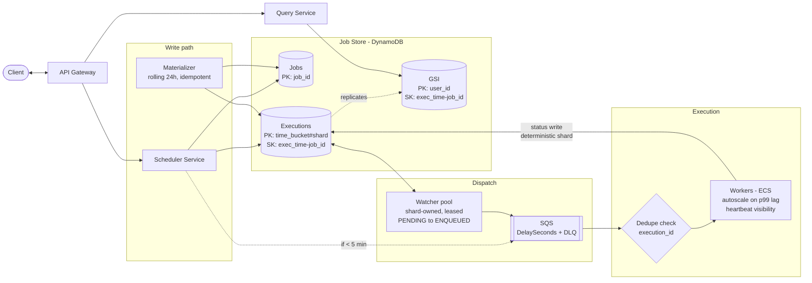

# Distributed Job Scheduler — System Design Revision

> One-line pitch: Take jobs (task + schedule + params) and execute them **within 2s of their scheduled time**, at **10k jobs/sec**, with **at-least-once** delivery, favoring **availability over consistency**.

---

## 1. Requirements

### Functional
- Schedule jobs for **immediate**, **future**, or **recurring** (CRON) execution.
- Users can **monitor job status**.
- *(Out of scope: cancel / reschedule.)*

### Non-Functional
- **Availability > Consistency.**
- Execute within **2s** of scheduled time.
- Scale to **10k jobs/sec**.
- **At-least-once** execution.
- *(Out of scope: security policies, CI/CD.)*

### Back-of-envelope
| Metric | Value |
|---|---|
| Throughput | 10k jobs/sec |
| Jobs per 5-min window | 10k × 300 = **3M** |
| SQS payload per window | 3M × ~200 B ≈ **600 MB** (trivial for SQS) |
| Status writes/sec | ~10–20k (each job writes IN_PROGRESS + COMPLETED) |
| DynamoDB partition ceiling | **~1,000 WCU/partition** → drives sharding |

---

## 2. Core Entities

- **Task** — abstract, reusable unit of work ("send an email").
- **Job** — a task instance with a schedule + params.
- **Schedule** — `CRON` (recurring) or `DATE` (one-time).
- **User** — owns jobs, queries status.

**Key insight:** separate the **job definition** from its **execution instances** (calendar analogy: one recurring event → many concrete occurrences). Storing raw CRON and evaluating every expression per pass does not scale.

---

## 3. API

### Create a job
```http
POST /jobs
Content-Type: application/json

{
  "task_id": "send_email",
  "schedule": { "type": "CRON", "expression": "0 10 * * *" },
  "parameters": { "to": "john@example.com", "subject": "Daily Report" }
}
```
```json
// 201 Created
{
  "job_id": "123e4567-e89b-12d3-a456-426614174000",
  "status": "SCHEDULED"
}
```

### Query job status
```http
GET /jobs?user_id=user_123&status=PENDING&start_time=1715500000&end_time=1715600000
```
```json
// 200 OK  -> served from the GSI, sorted by execution_time
{
  "executions": [
    {
      "job_id": "123e4567-e89b-12d3-a456-426614174000",
      "execution_time": 1715548800,
      "status": "COMPLETED",
      "attempt": 0
    }
  ],
  "next_cursor": "eyJwayI6..."   // pagination token
}
```

> Reads hit the **Query Service** (GSI); writes hit the **Scheduler Service** (base tables). Keep the read/write paths separate so they scale independently.

---

## 4. Data Model (DynamoDB) — the part interviewers grade hardest

### 4.1 Jobs table — definitions
| Field | Role | Notes |
|---|---|---|
| `job_id` | **Partition key** | UUID → writes spread evenly, no hot partition |
| `user_id` | attr | owner |
| `task_id` | attr | which task to run |
| `schedule` | attr | `{ type: CRON\|DATE, expression }` |
| `parameters` | attr | task inputs |

Access pattern: **point lookup by `job_id`**. Definition is stable; recurring jobs reuse it and spawn new execution rows.

```json
{
  "job_id": "123e4567-e89b-12d3-a456-426614174000",
  "user_id": "user_123",
  "task_id": "send_email",
  "schedule": { "type": "CRON", "expression": "0 10 * * *" },
  "parameters": { "to": "john@example.com", "subject": "Daily Report" },
  "created_at": 1715540000
}
```

### 4.2 Executions table — instances
| Field | Role | Notes |
|---|---|---|
| `pk` = `time_bucket#shard` | **Partition key** | hour bucket + deterministic shard (see below) |
| `sk` = `execution_time-job_id` | **Sort key** | time-ordered range queries; `job_id` makes the composite key unique |
| `job_id` | attr | FK into Jobs |
| `user_id` | attr | needed for GSI |
| `status` | attr | PENDING / ENQUEUED / IN_PROGRESS / COMPLETED / FAILED / RETRYING |
| `attempt` | attr | retry counter |

**time_bucket** = `(execution_time // 3600) * 3600` (floor to the hour).
Reads are cheap: to find everything due soon you query only the **current bucket (+ maybe next)** — 1–2 partitions instead of a table scan.

```json
{
  "pk": "1715547600#7",                         // time_bucket 1715547600, shard 7
  "sk": "1715548800-123e4567-e89b-12d3-a456-426614174000",
  "job_id": "123e4567-e89b-12d3-a456-426614174000",
  "user_id": "user_123",
  "status": "PENDING",
  "attempt": 0,
  "scheduled_time": 1715548800
}
```

#### Sharding (the single most important scaling move)
- **Problem:** partition key is an hour bucket → *all* writes for the current hour (incl. ~10–20k status updates/sec) hit **one partition** vs the ~1,000 WCU ceiling → hot partition.
- **Fix:** append a shard suffix: `pk = time_bucket#shard`.
- **Choose N:** need N ≥ 10–20 for throughput; pick **N = 32** for headroom/retries/growth.
- **Deterministic, not random:** `shard = hash(job_id) % N`. A worker can then locate its own row to write the status update without a lookup. (Random suffix breaks status writes.)
- **Read cost:** poll scatter-gathers `N × (current + next bucket)` ≈ 64 parallel queries every 5 min — negligible. So err toward more shards.

### 4.3 GSI on Executions — per-user queries
| Field | Role |
|---|---|
| `user_id` | **GSI partition key** |
| `execution_time-job_id` | **GSI sort key** |

- Solves "show me my jobs + status" without a Jobs full-scan + N lookups.
- **Tradeoffs / watch-outs:**
  - Extra write amplification + cost on every execution row.
  - GSI is **eventually consistent** → status right after execution may be stale (acceptable given availability > consistency; *say so out loud*).
  - **Second hot partition risk:** a whale user scheduling millions of jobs melts one GSI partition.
  - **Backpressure:** a throttled GSI throttles **base-table writes** too (provisioned mode).
  - **Mitigation:** sparse-index only recent/non-terminal executions; TTL old rows; consider a leaner status projection keyed `user_id#job_id`.

---

## 5. High-Level Architecture

```
client → API Gateway → Scheduler Service (writes) ─┐
                     → Query Service (reads) ───────┤→ Job Store (DynamoDB: Jobs + Executions + GSI)
                                                     │
                              Watcher (polls DB) ────┘→ SQS (delayed delivery) → Workers → execute
                                                                                     │
                                                                          update status → Executions
```

### Data flow
1. User creates a job → written to DB as `PENDING`.
2. **Watcher** queries Executions for jobs due in the next **~5 min**.
3. Pushes them to **SQS** with a delivery delay ≈ (execution_time − now).
4. **Workers** poll SQS, execute as messages become visible, write status back.
5. Job due in **< 5 min**? Scheduler writes it to DB **and** enqueues it directly to SQS.

---

## 6. Key Decisions — Best / Alternate / Tradeoff

| # | Decision | Best | Alternate | Why / Tradeoff |
|---|---|---|---|---|
| 1 | **Database** | DynamoDB (or Cassandra) | Postgres/MySQL | No strong consistency needed, KV access, easy horizontal scale. RDBMS works but you own scaling. |
| 2 | **2s precision** | DB poll ~5 min **+ message queue** | Poll cron every 2s | 2s poll = 20k rows/pass, 100s of ms/query, DB hammering. Queue removes polling as the timing upper bound. |
| 3 | **Delayed queue** | **SQS** `DelaySeconds` (≤15 min) | Redis ZSET (score=exec time) | SQS: managed, visibility timeouts, DLQ, ~unlimited throughput. Redis: sub-ms but you hand-roll retries/replication + SPOF. |
| 4 | **<5-min jobs** | Write to DB **+ enqueue directly to SQS** | — | Kafka rejected: in-order partitions stick the urgent job behind the backlog. |
| 5 | **Exec hot partition** | Write sharding `time_bucket#shard` | — | Fans writes across partitions; workers scatter-gather. |
| 6 | **Job-creation buffer** | **Skip it** (scale the service) | Kafka/RabbitMQ before creation | DB handles writes; queue is over-engineering unless creation has heavy fan-out. |
| 7 | **Worker compute** | **Containers** (ECS/K8s) + autoscale | Lambda | Steady high-volume → containers cheaper, no cold-start risk. Lambda elastic but cold starts threaten 2s SLA. |
| 8 | **Invisible failure** | SQS **visibility timeout + heartbeat** | Job leasing (DB lock) | Leasing = ~50k lease renewals/sec (2nd hot path) + clock-skew/partition dupes. |

---

## 7. Deep Dives

### 7.1 Precision (within 2s)
Two-layer scheduler = **durable DB** + **precise queue**.
- Poll DB every ~5 min (durability, low DB load).
- Push to SQS ordered by execution_time; workers drain as messages become visible.
- `DelaySeconds` is a **minimum, not a guarantee** — fine because workers poll continuously.
- **Honest framing:** precision holds only while **drain capacity ≥ arrival rate at peak**. It's really a capacity problem, not a timing one.

### 7.2 Scale to 10k/s
- Executions sharding (§4.2) is the main lever.
- Jobs table already scales (`job_id`).
- Cold storage: expire old executions via **DynamoDB TTL** → Streams → S3 (not scan-and-delete).
- SQS: ~3M msgs / 5-min window, ~600 MB — AWS handles it. Multiple queues only for **functional** separation (priority/type), not scale.

### 7.3 At-least-once execution
- **Visible failure** (bad code/params): try/catch → mark `RETRYING` → re-enqueue with exponential backoff via `DelaySeconds` (5s → 25s → 125s). Track with `ApproximateReceiveCount`; DLQ after 3 tries → `FAILED`.
- **Invisible failure** (worker dies): short visibility timeout (~30s); worker heartbeats via `ChangeMessageVisibility` for long jobs → fast re-pickup.

### 7.4 Idempotency (consequence of at-least-once)
- Make tasks **naturally idempotent**: idempotency keys, absolute ops ("set counter to X" not "increment"), dedupe on unique execution_id downstream.
- Most robust place for the guarantee is the task implementation — but see §8.2 for the system-level backstop.

---

## 8. Staff-Level Critique — issues the base design glosses over

> These are the "strong hire" signals. The first two are **correctness bugs**, not refinements.

### 8.1 🐛 Recurring-job chain can silently die
- Base design schedules the *next* occurrence when the current one **completes** → couples recurrence to worker success. Worker executes then crashes before writing the next row → the recurring job **stops forever**, undetectably.
- **Fix:** a separate **Materializer** reads CRON definitions and idempotently populates Executions for a **rolling window** (e.g. next 24h) via conditional put on the composite key. Recurrence survives any single failure and is naturally bounded.

### 8.2 🐛 Poll can double-enqueue
- 5-min poll + 5-min lookahead → overlapping windows enqueue the same execution twice, **on top of** SQS Standard's inherent duplicates. Base design offloads this entirely onto "make tasks idempotent."
- **Fix:** conditional status transition `PENDING → ENQUEUED`; only enqueue rows where the transition succeeds. Collapses poll-overlap dupes at the source. Keep task idempotency + a system-level dedupe store (execution_id → processed, checked before execution) as the backstop for unavoidable SQS redelivery.

### 8.3 Watcher is a SPOF / bottleneck
- Drawn as a singleton; one poller can't feed 10k/s, and N pollers re-introduce duplicate enqueues.
- **Fix:** partition poll work by **shard ownership** with lease-based election so exactly one poller owns each shard.

### 8.4 Thundering herd at round timestamps
- Nobody schedules 10:03:47 — everyone picks `10:00:00`, midnight, top-of-hour. 10k/s **average** spikes to 100k+ **at** 10:00:00.
- Every SLA component (SQS burst, worker drain, status-write WCU) must survive **peak, not average**.
- **Fix:** add **sub-second jitter** to scheduled times where the task tolerates it; provision/pre-warm for known spikes.

### 8.5 No golden signal
- The one metric that matters: **scheduling lag = actual − scheduled**, tracked as **p99**.
- Autoscale workers on **lag**, not just queue depth. Add DLQ + queue-depth + poll-lag alarms.

### 8.6 Smaller notes
- Drop the Kafka-before-creation queue (buffer heavy fan-out only, if any).
- Job leasing rejected correctly — real reason is the 2nd hot write path + clock skew, not merely "more infra."
- State the GSI eventual-consistency read explicitly.

---

## 9. Corrected Architecture (target state)

```
client → API Gateway
           ├─ Scheduler Service → Jobs + Executions (PENDING)
           │        └─ if <5min: also enqueue to SQS
           ├─ Materializer (rolling 24h window, idempotent) → Executions
           ├─ Watcher pool (shard-owned, leased)
           │        └─ conditional PENDING→ENQUEUED → SQS (DelaySeconds)
           ├─ Workers (ECS, autoscale on lag)
           │        ├─ dedupe check (execution_id)
           │        ├─ execute (idempotent task)
           │        ├─ heartbeat via ChangeMessageVisibility
           │        └─ status write → Executions (deterministic shard)
           └─ Query Service → GSI (user_id)
```

---

## 10. 60-Second Verbal Recap (say this in the room)

1. Separate **job definitions** from **execution instances** — the core idea.
2. Executions partitioned by **`time_bucket#shard`**, sort key **`execution_time-job_id`** — cheap "due soon" reads, sharded to kill the hot partition.
3. **Two-layer scheduler**: durable DB poll (~5 min) + **SQS delayed delivery** for 2s precision; sub-5-min jobs enqueued directly.
4. **GSI on `user_id`** for status queries — call out eventual consistency + hot-partition/backpressure tradeoffs.
5. At-least-once via **visibility timeout + heartbeat + backoff retries + DLQ**; idempotent tasks + dedupe store.
6. Staff signals: **materializer** (recurrence durability), **conditional ENQUEUED transition** (dedupe), **jitter** (herd), **p99 lag** (golden signal).

---

## 11. Challenges → Solutions (quick-reference table)

> Condensed pairing of §8 for fast revision. `🐛` = correctness bug, `⚙️` = scaling/reliability refinement. Lead with the two bugs — they're what separate "hire" from "strong hire."

| # | Challenge | Root cause | Solution | Type |
|---|---|---|---|---|
| 1 | Recurring job silently stops forever | Next occurrence scheduled only *after* worker completes → coupled to worker success | **Materializer** populates Executions for a rolling 24h window, idempotently (conditional put on composite key) — decoupled from execution | 🐛 |
| 2 | Same execution enqueued twice | 5-min poll + 5-min lookahead overlap, *plus* SQS at-least-once dupes | Conditional status transition **`PENDING → ENQUEUED`**; enqueue only on success. Backstop: system-level **dedupe store** (`execution_id → processed`) checked before execution | 🐛 |
| 3 | Watcher is a SPOF + can't feed 10k/s | Drawn as a singleton; N pollers re-introduce dupes | **Shard-owned pollers** with lease-based election → exactly one poller per shard | ⚙️ |
| 4 | Hot partition on Executions | Hour-bucket PK → all writes (incl. ~10–20k status updates/s) hit one partition vs ~1k WCU cap | **Write sharding** `time_bucket#shard`, `shard = hash(job_id) % 32` (deterministic so status writes find their row); poll scatter-gathers shards | ⚙️ |
| 5 | GSI hot partition + write backpressure | `user_id` PK → whale user melts a partition; throttled GSI throttles base table too | Sparse-index recent/non-terminal rows; **TTL** old rows; consider leaner `user_id#job_id` status projection | ⚙️ |
| 6 | Thundering herd at round timestamps | Everyone schedules `10:00:00` → avg 10k/s spikes to 100k+ instantaneously | Add **sub-second jitter** where task tolerates it; provision/pre-warm for known spikes; size for peak not average | ⚙️ |
| 7 | Can't tell if 2s SLA is met | No golden signal defined | Track **scheduling lag (p99) = actual − scheduled**; autoscale workers on lag; alarm on DLQ + queue depth + poll lag | ⚙️ |
| 8 | Precision degrades under load | `DelaySeconds` is a *minimum*, not a guarantee | Reframe as a **capacity problem**: precision holds only while drain capacity ≥ peak arrival rate → autoscale + pre-warm | ⚙️ |

---

## 12. Corrected Architecture Diagram

> Mermaid — renders as a diagram in GitHub, Obsidian, VS Code (Markdown Preview Mermaid), and most modern viewers.



### Plain-text fallback (if Mermaid doesn't render)

```
client ⇄ API Gateway
   ├─ Scheduler Service ── writes ──▶ Jobs (PK job_id)
   │        │                        Executions (PK time_bucket#shard, SK exec_time-job_id, PENDING)
   │        └─ if < 5 min ───────────────────────────────▶ SQS
   ├─ Materializer (rolling 24h, idempotent) ── writes ──▶ Executions
   ├─ Watcher pool (shard-owned, leased)
   │        └─ conditional PENDING→ENQUEUED ─────────────▶ SQS (DelaySeconds + DLQ)
   │                                                          │
   │                                                          ▼
   │                                                   Dedupe (execution_id)
   │                                                          │
   │                                                          ▼
   │                                          Workers (ECS, autoscale on p99 lag,
   │                                          heartbeat via ChangeMessageVisibility)
   │                                                          │
   │                        status write (deterministic shard)▼
   │                                                     Executions ──replicates──▶ GSI (PK user_id)
   └─ Query Service ────────────────────────── reads ──────────────────────────────▶ GSI
```
