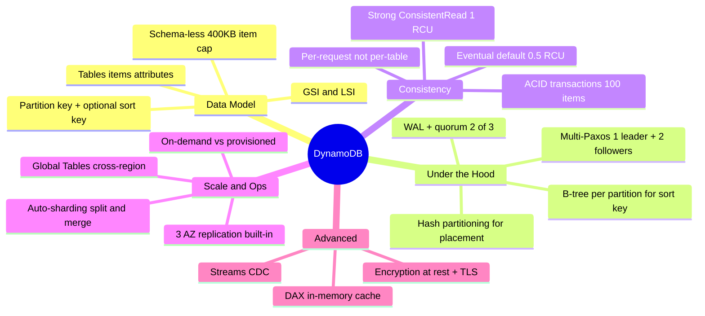
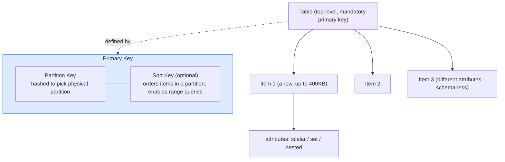
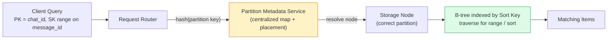
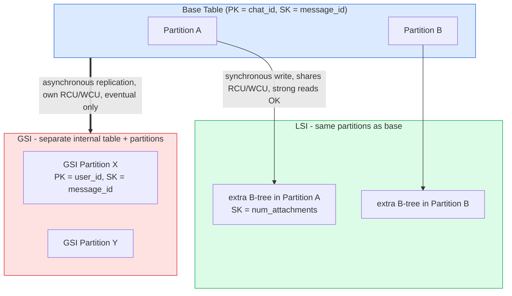
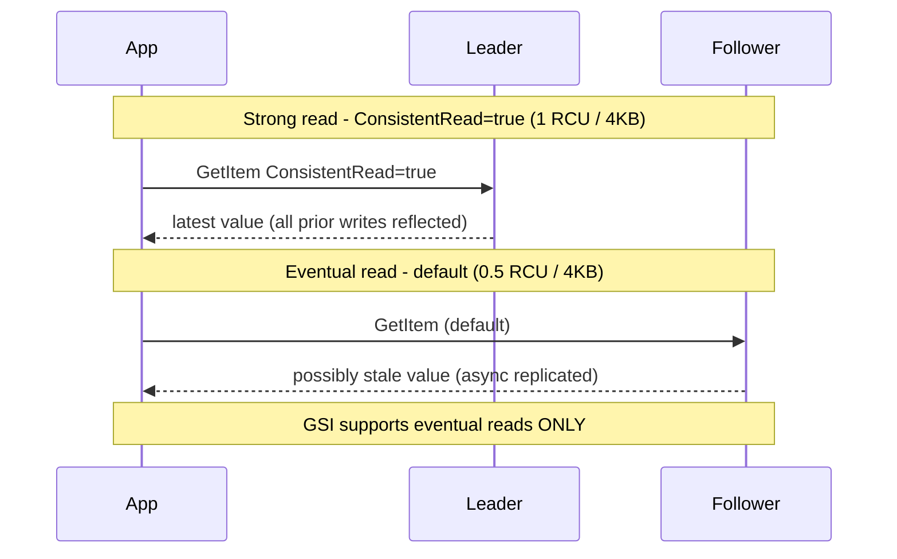
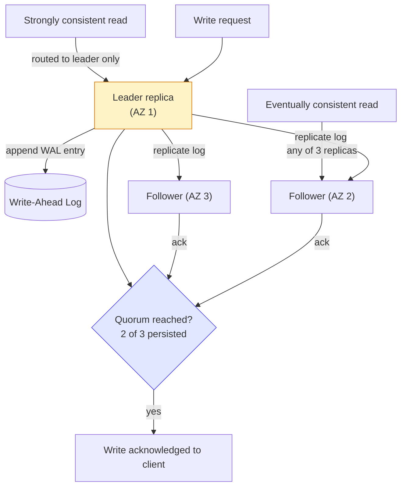
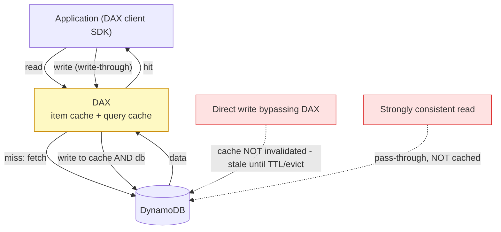
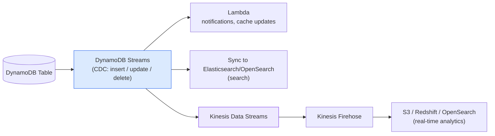
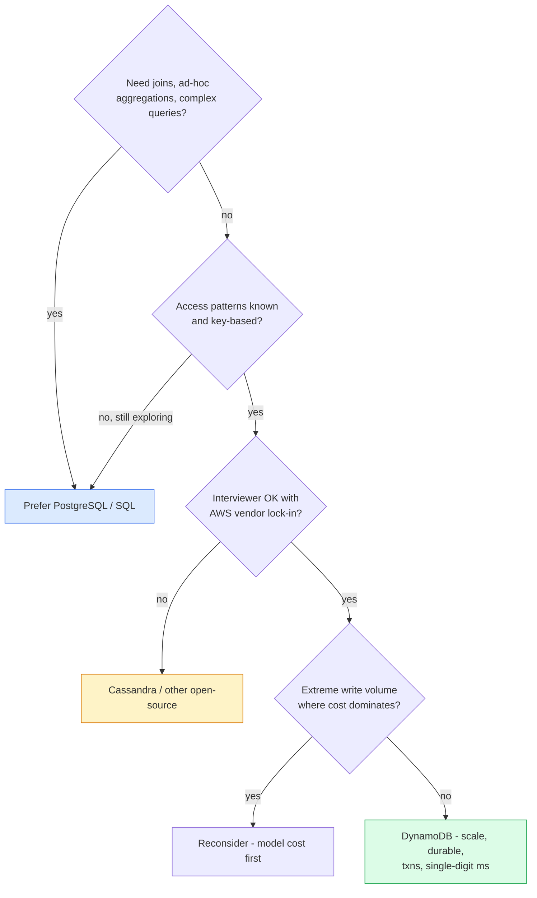

# DynamoDB — System Design Interview Notes

> **One-liner for the interview:** *"DynamoDB is a fully-managed, serverless, key-value/document NoSQL database. It gives me predictable single-digit-millisecond latency at effectively unlimited scale by hashing a partition key to place data and using a B-tree per partition for sort-key range queries. It's AP-by-default but lets me opt into strong consistency and ACID transactions per request."*

That sentence alone signals senior-level command. Everything below is the "why" behind each clause and the gotchas that separate a mid-level answer from a staff one.

---

## 0. How to use these notes

The source notes (Hello Interview style) describe **what** each feature is but frequently stop short of the **why** and the **failure modes**. This document fills those gaps: for every mechanism I give the design reasoning, the trade-off, and the specific fact that interviewers probe. Jump to §14 (gotchas) and §15 (mock Q&A) the night before an interview.

---

## 1. Data Model

| Concept | Relational analogue | Notes |
|---|---|---|
| **Table** | Table | Top-level structure; defined by a **mandatory primary key**. Supports secondary indexes. |
| **Item** | Row | Collection of attributes. **Hard cap: 400 KB per item** (all attributes included). |
| **Attribute** | Column/cell | Key-value pair. Scalar (string/number/bool), set (string/number set), or **nested** (maps/lists). |

**Schema-less** — you don't declare columns up front. Two items in the same table can carry different attributes (one user has `FavoriteColor`, another doesn't). JSON is only the *transport* format; the on-disk format is proprietary.

> **Why it matters / the catch:** flexibility is pushed to the application. DynamoDB enforces **nothing** about attribute uniformity, so validation is *your* job. In an interview, mention that schema-less-ness is a double-edged sword: fast iteration, but you own data integrity.

---

## 2. Partition Key & Sort Key — the single most important decision

`Primary Key = Partition Key [+ optional Sort Key]`

- **Partition Key (PK / hash key):** hashed to decide *which physical partition* stores the item. Choose it to (a) match your **most common query pattern** and (b) **spread load evenly** (avoid hot partitions).
- **Sort Key (SK / range key):** orders items *within* a partition. Enables **range queries** (`>=`, `between`, `begins_with`) and sorted retrieval.

**Canonical example — group chat:** `PK = chat_id`, `SK = message_id`. Lets you fetch *"all messages in a chat, in order"* with one efficient query.

### Why a monotonic ID for the sort key, not a timestamp?
A timestamp isn't unique — two messages in the same millisecond collide. A **monotonically increasing ID gives ordering *and* uniqueness**. Generation options, cheapest signal to strongest:
- **Per-partition auto-increment counter**
- **UUID v7** — timestamp-first layout ⇒ naturally lexicographically sortable as a string, and (unlike v1) doesn't leak the MAC address. *Prefer v7 over v1.*
- **Snowflake IDs** (time + machine + sequence)
- **ULID**

> **Staff-level nuance:** naming *why* v7 beats v1 (sortability + no MAC leakage) is exactly the kind of detail that reads as "this person has actually shipped this."

### Hot-partition trap (say this unprompted)
If your PK concentrates traffic (e.g. `PK = country` for a US-heavy app, or a single trending `video_id`), one partition saturates its **~3,000 RCU / 1,000 WCU** ceiling while others idle. Mitigations: pick a higher-cardinality key, or **write-shard** by suffixing the key (`video_id#0..N`) and scatter-gather on read.

---

## 3. Under the Hood — how a query is actually served

Two-tier mechanism = horizontal scale **and** fast in-partition queries:

1. **Hash partitioning for placement.** A **request router** hashes the partition key and consults a **centralized partition metadata / placement service** to map it to the owning storage node. (Conceptually like consistent hashing, but DynamoDB uses a *central map + placement service*, **not** the peer-to-peer ring of the 2007 Dynamo paper.) This service also drives automatic **split/merge** of partitions as data grows.
2. **B-tree per partition for the sort key.** Inside a partition, items live in a **B-tree keyed by the sort key** ⇒ efficient range scans and ordered reads.
3. **Composite lookup:** hash the PK to find the node, then walk the B-tree on the SK to the exact item(s).

---

## 4. Secondary Indexes — GSI vs LSI

**Problem they solve:** querying by an attribute that *isn't* the table's partition key.

- **GSI (Global Secondary Index):** *different* partition key (and optional sort key) from the base table. Because the PK differs, it lives on **entirely separate physical partitions, replicated separately**. → Query across all partitions by a new dimension.
  - *Chat example:* base is `chat_id / message_id`; add a GSI `user_id / message_id` to answer *"all messages this user sent across every chat."*
- **LSI (Local Secondary Index):** *same* partition key, *different* sort key. Co-located on the **same partitions** as the base item. → Alternate sort/range dimension **within** a partition.
  - *Chat example:* an LSI on `num_attachments` to find the most-attachment-heavy messages within a chat.

| Feature | **GSI** | **LSI** |
|---|---|---|
| Partition key | Different from base | **Same** as base |
| Physical storage | Separate internal table + partitions | Co-located with base partitions |
| Update propagation | **Asynchronous** (eventually consistent) | **Synchronous** with base write |
| Consistency on read | **Eventually consistent only** | Eventual (default) **or strong** |
| Throughput (RCU/WCU) | **Its own**, separate from base | **Shares** the base table's |
| Size limits | No per-key limit | **≤ 10 GB per partition key** |
| Create / delete | **Anytime** | **Only at table creation**, never added/removed later |
| Max per table | Up to **20** | Up to **5** |

> **The three facts interviewers love to test:**
> 1. **GSIs are eventually consistent — always.** No strong reads on a GSI. If an access path needs strong consistency, it must go through the base table or an LSI.
> 2. **LSIs are creation-time only.** You cannot add one later, so you must anticipate the access pattern up front. (Reason: an LSI shares the base partition and its 10 GB/key limit, so it changes the partition's storage contract.)
> 3. **GSI writes are async** ⇒ a read-after-write against a GSI can miss the latest item. Design around it (or read the base table).

---

## 5. Accessing Data — Query vs Scan (and the PartiQL/projection traps)

- **Query** — retrieves by primary key or index key. Efficient: reads only items matching the key condition; supports SK range conditions. **This is what you want.**
- **Scan** — reads *every* item, paginated. Expensive; avoid on large tables. Its existence is usually a sign of a **data-modeling miss**.

**PartiQL:** DynamoDB supports a SQL-ish dialect (`SELECT/INSERT/UPDATE/DELETE`). It's a **convenience layer** — it compiles down to the same Query/Scan/GetItem ops. It does **not** add joins or relational power.

### Two gotchas that trip up strong candidates
- **`ProjectionExpression` ≠ SQL column selection.** It only trims **network bandwidth**. The **full item is still read from storage and you're billed the full RCU** for the item's total size. → For large items, **normalize** (split hot/cold attributes into separate tables) rather than relying on projection.
  - *Yelp example:* keep `reviews` in a **separate table** from `business` so reading a business name/address doesn't drag every review into the RCU bill.
- **Default reads return the whole item.** Model with that cost in mind.

---

## 6. Consistency & CAP

**Key correction to the tired "DynamoDB = AP" reflex:** consistency is a **per-request** choice, **not a table setting.** You pass `ConsistentRead=true` on each `GetItem` / `Query` / `Scan`.

| Model | Cost | Behavior |
|---|---|---|
| **Eventual (default)** | **0.5 RCU** / 4 KB | Highest availability, lowest latency; may not reflect the newest write. AP + BASE. |
| **Strong** (`ConsistentRead=true`) | **1 RCU** / 4 KB (2×) | Reflects all successful writes before the read; slightly higher latency. |

- **ACID transactions:** `TransactWriteItems` / `TransactGetItems` give **serializable isolation** across **up to 100 items spanning multiple tables**. → The old *"NoSQL means no transactions"* criticism is dead.
- **Strong reads are supported on the base table and LSIs only — never on a GSI.**

> **How to wield this in the NFR phase:** default everything to eventual for read-heavy, latency-sensitive paths; opt into strong reads (and/or transactions) only on the specific paths that need correctness (e.g. a booking/seat-reservation flow, inventory decrement). This is the nuanced answer that beats "I picked DynamoDB because it's AP."

---

## 7. Architecture, Scalability & Fault Tolerance

### Scaling
- **Auto-sharding + load balancing.** When a partition hits a size **or** throughput ceiling, DynamoDB **splits** it and redistributes — no downtime. Hash partitioning keeps distribution even.
- **Global Tables** — active-active, real-time **cross-region** replication; local read/write worldwide, lower latency. In an interview, *"use Global Tables for cross-region"* is usually enough detail.

### Replication & fault tolerance (the under-the-hood answer)
- Every partition is a **replication group of 3 nodes across 3 AZs**: **1 leader + 2 followers**. This is **not user-configurable** (3-AZ, 3-replica is automatic). Global Tables add *cross-region* replicas on top.
- **Writes** use **Multi-Paxos**, leader-based:
  1. Leader writes a **WAL (write-ahead log)** entry and ships it to peers.
  2. Write is **acknowledged once a quorum (2 of 3) persists** the log record.
- **Reads:** strong ⇒ routed to the **leader** (always current); eventual ⇒ **any of the 3 replicas** (lower latency, possibly stale because leader→follower replication is async after quorum).

### Security (one line is plenty in an interview)
**Encrypted at rest by default; TLS enforced in transit (no config needed).** IAM for fine-grained access; VPC endpoints to keep traffic off the public internet. Anything beyond this is usually overkill for an interview.

---

## 8. Pricing & Back-of-the-Envelope Math

Pricing matters in interviews because it **constrains architecture** and enables sanity-checks.

- **Two modes:** **On-demand** (per-request; unpredictable workloads) vs **Provisioned** (specify RCU/WCU, billed hourly; cheaper for predictable load, risks idle waste).
- **Capacity units:**
  - **1 RCU** = one **strongly** consistent read/sec of up to **4 KB** (**or two eventually consistent** reads/sec).
  - **1 WCU** = one write/sec of up to **1 KB**.
- **Rounding:** every read rounds up to 4 KB, every write up to 1 KB. A 10-byte write still costs **1 full WCU**.

### The partition ceiling (memorize for BOTE)
Each partition supports up to **~3,000 RCU** and **~1,000 WCU** ⇒ **~12 MB/s reads** (3,000 × 4 KB) and **~1 MB/s writes** (1,000 × 1 KB) per partition.

**Worked example — YouTube-style view counter:**
- Every view = 1 write, rounds up to **1 WCU**.
- 1,000 WCU/partition ⇒ **~1,000 writes/s/partition**.
- Target **10,000,000 views/s** ⇒ **~10,000 partitions**.
- At ~\$0.00065 per WCU-hour (us-east-1, provisioned): `10,000,000 WCU × $0.00065 × 24h ≈ $156,000/day`. On-demand would be materially higher.

> **Use this as a gut-check, not a quote.** The point is to show you can reason about whether a design is affordable and where the write-throughput cliffs are.

---

## 9. Advanced Features

### DAX (DynamoDB Accelerator) — the built-in cache
Purpose-built **in-memory cache**, **microsecond** reads. Often removes the need to bolt on Redis/Memcached.

- **Read-through + write-through**: serves cached reads; on write, writes to **both** cache and DynamoDB.
- **Two always-on caches:** an **item cache** (`GetItem`/`BatchGetItem`) and a **query cache** (`Query`/`Scan`). No either/or config.
- **Not fully transparent:** you swap to the **DAX client SDK** (Java/.NET/Node/Python/Go). API-compatible, minimal changes — but a change.

**Two invalidation gotchas (say these):**
1. **DAX only auto-invalidates writes that go *through* DAX.** A **direct** write to DynamoDB (bypassing DAX) leaves stale cache entries until **TTL/eviction**.
2. **DAX does NOT cache strongly consistent reads** — those pass straight through to DynamoDB and return uncached.

### Streams — Change Data Capture (CDC)
Captures every **insert/update/delete** as a stream record for real-time downstream processing.

- **Search sync:** keep an **Elasticsearch/OpenSearch** index in sync with the table (search on top of DynamoDB).
- **Real-time analytics:** enable **Kinesis Data Streams** on the table → **Kinesis Firehose** → S3/Redshift/OpenSearch.
  - **Gotcha:** Firehose **cannot** read DynamoDB Streams directly. You need **Kinesis Data Streams or a Lambda** as the intermediary.
- **Change notifications / side effects:** trigger **Lambda** on changes (notifications, cache updates, fan-out).

---

## 10. When to Use It — and When NOT To

**Reach for DynamoDB when:** you need massive scale, durability, predictable single-digit-ms latency (µs with DAX), known key-based access patterns, and the interviewer allows AWS. It even does transactions and cross-store consistency (Streams).

**Prefer something else when:**
| Reason | Why | Better fit |
|---|---|---|
| **Complex queries** | No joins, no ad-hoc aggregations. Transactions exist (≤100 items) but querying is key-based. | PostgreSQL / SQL |
| **Cost at extreme write volume** | Per-request + storage pricing; hundreds of K writes/s can dominate cost. | Cassandra / self-hosted |
| **Heavy GSI/LSI reliance** | If you're constantly adding indexes to force query flexibility, the model is fighting you. | Relational DB |
| **Vendor neutrality** | DynamoDB = AWS lock-in; many interviewers want open-source. | Cassandra / ScyllaDB |
| **Access patterns unknown** | DynamoDB rewards *knowing* your queries up front; exploratory schemas suffer. | SQL |

> **First move in any interview:** *ask if DynamoDB (or any managed AWS service) is allowed.* Some interviewers require open-source to avoid lock-in.

---

## 11. Trade-off Cheat Sheet

| Decision | Option A | Option B | Pick B when... |
|---|---|---|---|
| **Consistency (per read)** | Eventual (0.5 RCU, fast, may be stale) | Strong (1 RCU, current, leader-routed) | Correctness matters on that path (booking, inventory). |
| **Index type** | GSI (new PK, own capacity, async, eventual-only) | LSI (same PK, shared capacity, sync, strong-capable) | You need a strong-read alternate sort within a partition **and** knew it at create time. |
| **Capacity mode** | On-demand (per-request) | Provisioned (hourly RCU/WCU) | Load is predictable and you want lower unit cost. |
| **Caching** | DAX (built-in, µs, DynamoDB-only) | Redis (flexible, cross-source) | You need data structures/pub-sub beyond key-value caching. |
| **Big items** | Store everything in one item | Normalize into multiple tables | Reads only need a subset — projection still bills the full RCU. |
| **Sort key** | Timestamp | Monotonic ID (UUIDv7/Snowflake/ULID) | Almost always B — need uniqueness + ordering. |
| **Hot key** | Natural key | Write-sharded key (`key#0..N`) | One value concentrates traffic past ~1,000 WCU / 3,000 RCU. |

---

## 12. Interview Gotchas — the fast-recall list

- **GSI = eventually consistent, always.** No strong reads. Async propagation ⇒ read-after-write can miss.
- **LSI = table-creation-time only.** Can't add/remove later; 10 GB per partition-key cap; shares base capacity; strong reads OK.
- **Consistency is per-request**, set by `ConsistentRead=true`, **not** a table property.
- **`ProjectionExpression` saves bandwidth, not RCU.** Full item is read and billed.
- **Scan reads everything** — treat needing one as a modeling smell.
- **3 replicas across 3 AZs, 1 leader + 2 followers, Multi-Paxos, quorum = 2 of 3.** Not configurable.
- **Strong read → leader; eventual read → any replica.**
- **DAX doesn't cache strong reads**, and only invalidates on writes that pass through DAX.
- **Firehose can't read Streams directly** — need Kinesis Data Streams or Lambda in between.
- **Transactions:** serializable, up to **100 items**, across multiple tables.
- **Item cap 400 KB.** Partition ceilings **~3,000 RCU / ~1,000 WCU**.
- **1 RCU = 4 KB (strong) / 8 KB (eventual, i.e. 2 reads); 1 WCU = 1 KB**, both rounded up.
- **UUIDv7 > v1** (sortable, no MAC leak).
- **Encrypted at rest by default; TLS always on.**

---

## 13. Mock Interview Q&A — staff-level curveballs

**Q1. "You put a GSI on `user_id` and read it right after writing the base item, but the new record isn't there. Why, and how do you fix it?"**
GSIs are maintained **asynchronously**, so a read immediately after the base write can hit the GSI before propagation completes — and GSIs **only** support eventual reads, so you can't force freshness there. Fixes: (a) if the access path needs read-after-write, **query the base table** (strong read) instead of the GSI; (b) restructure so that dimension is the **base table's** key or an **LSI** (strong-capable); (c) accept eventual consistency and handle the lag in the UX. *Design tweak it forces:* you may duplicate the entity into a second table keyed by `user_id` (single-table/adjacency-list modeling) so both access paths get strong reads — trading write amplification for read correctness.

**Q2. "Your view-counter table has a viral video and you're getting throttled despite low average utilization. Diagnose."**
Classic **hot partition**: all writes for that `video_id` hash to one partition, saturating its **~1,000 WCU** ceiling while other partitions idle — average capacity looks fine, one partition is on fire. Fix: **write-shard** the key (`video_id#{0..N}`), scatter writes across N logical partitions, and **scatter-gather + sum** on read. *Trade-off it forces:* reads now fan out to N items and aggregate, so you're trading read complexity/latency for write headroom; pick N from expected peak WCU ÷ 1,000.

**Q3. "You added DAX and reads got faster, but users occasionally see stale data. What's going on?"**
Two likely causes. (1) Some write path **bypasses DAX** and writes DynamoDB directly — DAX only auto-invalidates writes that go **through** it, so those entries stay stale until **TTL/eviction**. (2) The stale reads are eventually consistent and served from a cached value that's older than a very recent write. Fix: route **all** writes through the DAX client, tune the item/query-cache **TTLs** to your staleness tolerance, and for any path that must be current, issue a **strongly consistent read** (which DAX passes through uncached) — accepting you lose the cache benefit there. *Trade-off:* correctness vs the µs latency win.

**Q4. "Design the data model for a chat app: fetch a chat's messages in order, and fetch one user's messages across all chats. Which keys and indexes?"**
Base table `PK = chat_id`, `SK = message_id` (monotonic, e.g. UUIDv7) → "all messages in a chat, ordered" is a single efficient query. Add a **GSI** `PK = user_id`, `SK = message_id` → "all messages by a user across chats." Project only the attributes those queries need to bound GSI storage/write cost. *Curveball follow-up — "now show most-attachment-heavy messages within a chat":* that's an alternate sort **within** the partition ⇒ an **LSI** on `num_attachments` — but only if you defined it **at table creation**; if the table already exists, you're forced to either a new GSI or a maintained aggregate, because LSIs can't be added later.

**Q5. "This flow needs to atomically decrement inventory and create an order across two tables. Can DynamoDB do it, and what are the limits?"**
Yes — `TransactWriteItems` gives **serializable isolation** across **multiple tables**, up to **100 items** per transaction, with condition checks (e.g. `stock > 0`). Beyond 100 items, or for long-running/multi-step human workflows, DynamoDB transactions aren't the tool — you'd move to an orchestration layer (Step Functions / a workflow engine) with idempotent, compensating actions (saga). *Trade-off it forces:* transactions cost **2× the WCU** (they do a prepare+commit) and can fail on contention, so you design for retries and keep the transaction item-count small.

**Q6. "Interviewer says 'no vendor lock-in.' Walk me through swapping DynamoDB out."**
Map each DynamoDB feature to an open-source equivalent: the core key-value/wide-column store → **Cassandra/ScyllaDB** (tunable consistency, similar partition/clustering-key model); DAX → **Redis**; Streams/CDC → **Debezium/Kafka**; Global Tables → multi-region Cassandra or app-level replication. Call out what you *lose*: fully-managed ops, built-in 3-AZ replication, seamless auto-scaling, and per-request strong/eventual toggling — you now own compaction tuning, repair, and capacity planning. *Trade-off it forces:* portability and cost control vs operational burden.

**Q7. "How does DynamoDB give predictable latency at any scale when a SQL DB degrades?"**
Because access is **key-based and partition-local**: hash the PK to one node, walk a B-tree on the SK — O(log n) *within a bounded partition*, and partitions **split** as they grow so no single partition's working set balloons. There are no joins, no cross-partition query planner, no table scans on the hot path. The cost is **modeling rigidity** — you must know your access patterns up front and often denormalize/duplicate data to serve each one. That's the fundamental trade: SQL gives query flexibility with unpredictable tail latency at scale; DynamoDB gives predictable latency by making you pre-commit to your queries.
