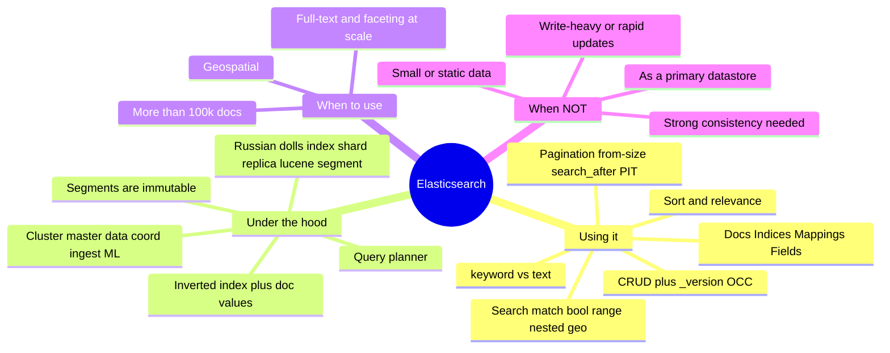
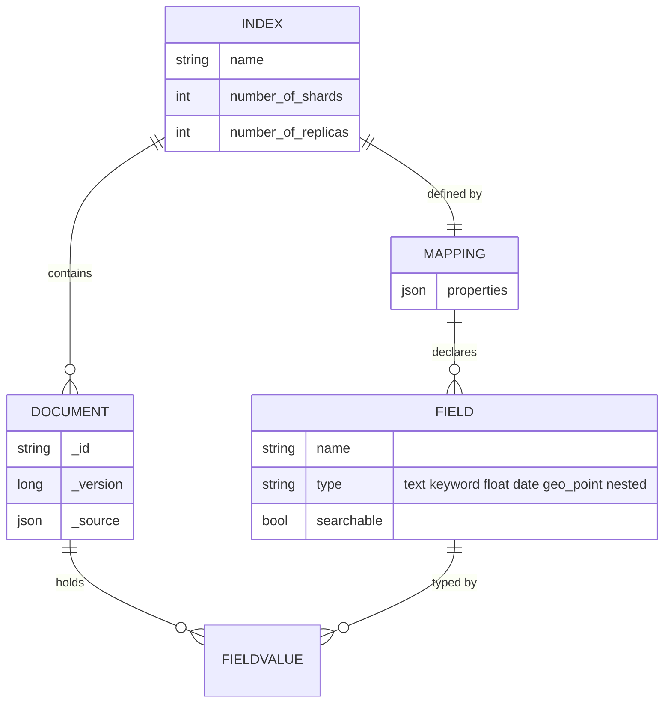
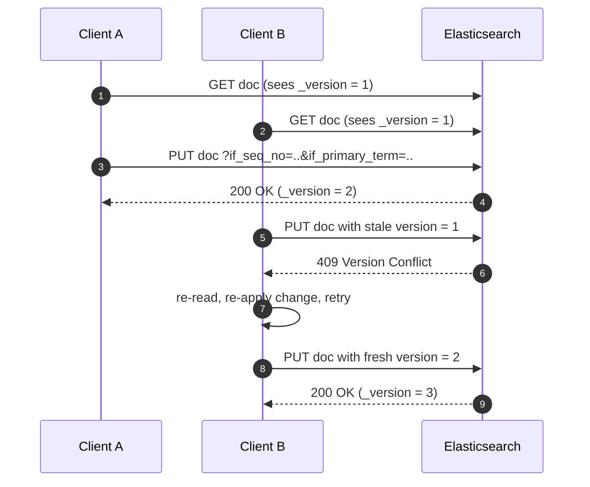
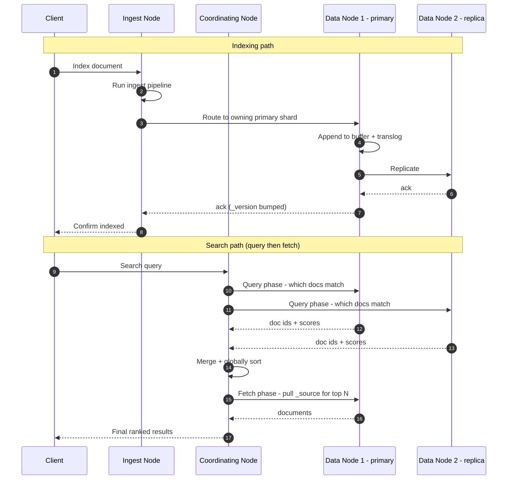
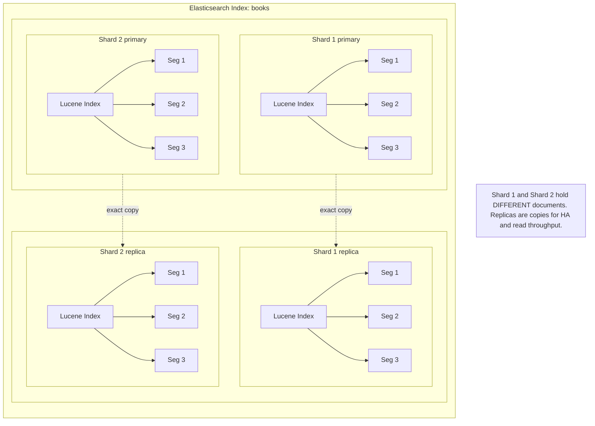
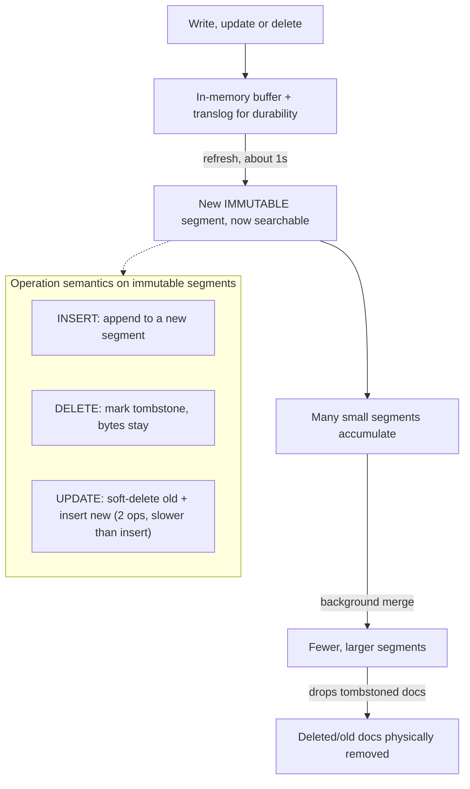
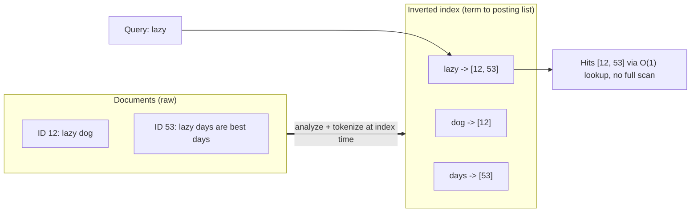
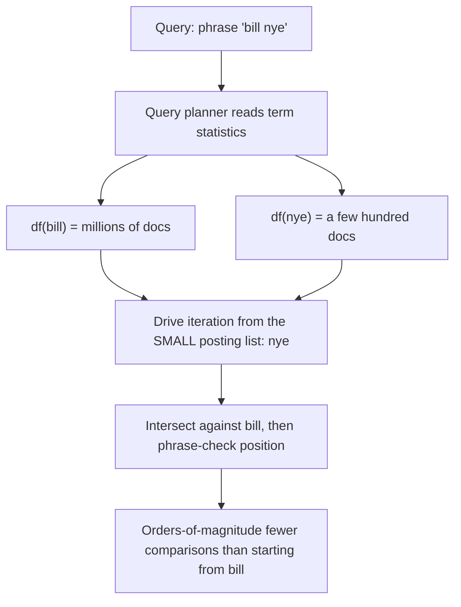
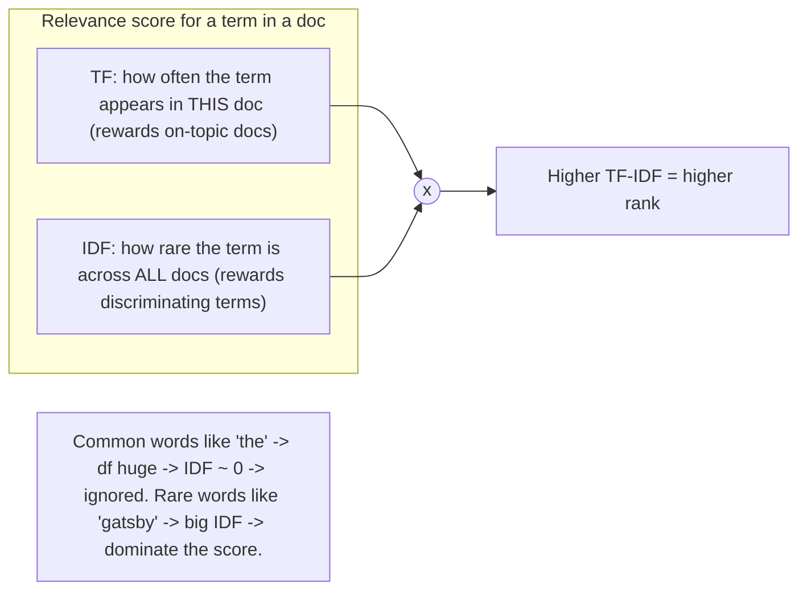
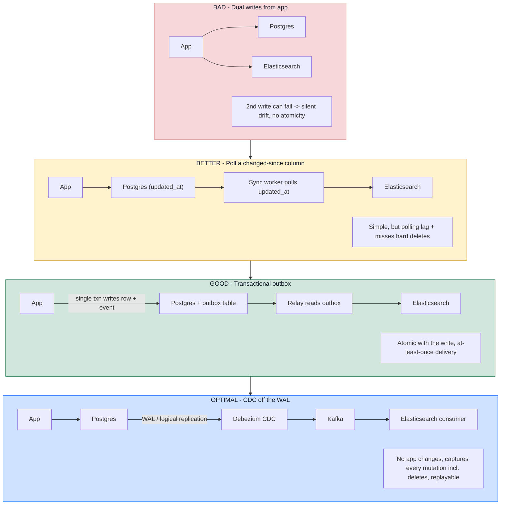

# Elasticsearch — System Design Deep-Dive Notes

> **How to read these notes.** This is a *technology deep-dive* ("know your tools"), not a design problem, so the usual playbook (requirements → entities → API → HLD → deep dives → final design) has been reshaped to fit a component while keeping the parts that carry weight in an interview: staff-level framing, the answers the source notes abstract away, a diagram per concept, a colored bad→optimal progression on the hardest deep dive, a trade-off cheat sheet, and staff-level mock Q&A. The single most valuable thing to internalize: **Elasticsearch is a distributed orchestration layer over Apache Lucene.** Elasticsearch owns the cluster (coordination, sharding, APIs, aggregations, near-real-time); Lucene owns the actual search (segments, inverted index, doc values, scoring). Almost every "how does it work" answer bottoms out in Lucene.

---

## 1. TL;DR — what it is, when to reach for it, when not to

Elasticsearch (ES) is a distributed search engine for **search and retrieval at scale**: full-text matching plus sorting, filtering, ranking, faceting, and geospatial — the moment a `WHERE title LIKE '%...%'` or a Postgres full-text index stops being enough.

There are **two interview angles**, and gnarly interviewers (especially for infra/cloud roles) will push you into the second:

1. *Using it* — you reach for ES as a component in a design (Yelp search, Ticketmaster event search, log search, autocomplete). Product-architecture and startup interviews.
2. *How it works* — "pretend Elasticsearch doesn't exist, build the search index yourself." Inverted index, doc values, segment immutability, query planning. Infra-heavy roles.

**Reach for ES when:** full-text / fuzzy / relevance-ranked search; faceting and aggregations over large result sets; geospatial ("restaurants within 5km, sorted by rating"); more than ~100k documents; read-heavy workloads.

**Do NOT reach for ES when:** it would be your *primary datastore* (it is not your source of truth); the data is *write-heavy or rapidly mutating* (segment churn will punish you — see §4.3); you need *strong consistency / read-your-writes* (ES is near-real-time, default ~1s refresh lag); the dataset is *small (<100k) or static* (a plain query on Postgres/DynamoDB is faster and simpler). In an interview, **be ready to justify the choice and name the limitation** — reaching for ES unprompted on a 10k-row problem is a red flag.

The canonical placement: **ES is attached via Change Data Capture (CDC) to an authoritative store** (Postgres, DynamoDB). Writes go to the source of truth; ES is a derived, denormalized read model. (Full progression in §6.)



---

## 2. Mental model — documents, indices, mappings, fields

Four client-facing nouns. Map them to concepts you already know:

| ES term | Think of it as | Notes |
|---|---|---|
| **Document** | A row / a JSON object | The unit you search over. Has an `_id` and a `_version`. Its raw JSON is stored as `_source`. |
| **Index** | A table | A collection of documents. Searches run against an index and return matching docs. (Overloaded word — this is the *table-like* index, not the inverted-index data structure.) |
| **Mapping** | The schema | Declares fields, their types, and how each is analyzed/indexed. |
| **Field** | A column | A typed key inside documents. Whether it's searchable is decided by the mapping. |

### `keyword` vs `text` — the distinction the notes gloss over

This is *the* mapping decision and a favorite interviewer probe. Same string data, two completely different index-time treatments:

- **`text`** → the value is run through an **analyzer** (tokenized, lowercased, stemmed, stop-words removed) and fed into the **inverted index**. Use for *full-text relevance* search ("great" matches "The Great Gatsby"). It is **analyzed**, scored, and **not** efficiently sortable/aggregatable.
- **`keyword`** → the value is stored **whole, un-analyzed** (one token). Use for *exact match, sorting, aggregations, and filtering* (status, category, `id`, tags). Mentally: `keyword` behaves like a hash-table lookup; `text` like a reverse index.

You often want **both** on one field via a **multi-field**: `title` (text, for search) + `title.keyword` (keyword, for sort/exact-match/agg). Interviewers love: *"you already have `title` as text, why add `title.keyword`?"* → because you can't cleanly sort or aggregate on an analyzed field.

### Mapping is a performance lever, not just a schema

Every mapped field carries memory overhead (Lucene structures per field). **Don't map fields you'll never search.** The notes' example: a `User` with 10 fields but only 2 searchable — map the 2, not the whole object, or you burn memory on 8 dead fields across every shard. Most of the query-performance control you exert in ES is *mapping + cluster parameters*.

### nested vs separate index (the normalize/denormalize call)

Given `reviews` inside a `book`: nest them **inside** the book doc if reviews are *frequently queried and infrequently updated* (co-located, one query gets everything). Split reviews into their **own index** if they update often (remember: an update rewrites the whole parent doc — see §4.3, so churny nested data is expensive). This is exactly the SQL normalization/denormalization trade-off. `nested` type also has a real cost: each nested object is indexed as a hidden separate Lucene doc, so deep nesting inflates doc counts.



---

## 3. Core operations (the "API design" section)

ES exposes a clean JSON-over-REST API. The interview value here isn't the syntax — it's the **write semantics and the security posture**.

### Create index + set mapping

```
PUT /books                      { "settings": { "number_of_shards": 1, "number_of_replicas": 1 } }
PUT /books/_mapping             { "properties": { "title": {"type":"text"}, "author": {"type":"keyword"}, "price": {"type":"float"}, ... } }
```
Dynamic mapping auto-infers types on first write; set an explicit mapping when most fields aren't searchable or you care about types. **`number_of_shards` is fixed at creation** — you can't change it later without a `_split`/`_shrink`/reindex (see §4.2 and the mock Q&A). `number_of_replicas` *is* changeable live.

### Write + the `_version` field

```
POST /books/_doc                { ... }        -> returns _id and _version: 1
```
Every write returns and bumps `_version`. This exists because ES is **distributed, asynchronous, and concurrent** — your requests hit many nodes and can arrive out of order, so the API is explicit about update semantics.

### Update — three flavors, in increasing safety

1. **Full replace** `PUT /books/_doc/{id}` — resends the whole doc. Risky: a concurrent writer's changes get clobbered (last-write-wins).
2. **Optimistic concurrency control (OCC)** `PUT /books/_doc/{id}?if_seq_no=..&if_primary_term=..` — only applies if the doc hasn't changed since you read it; otherwise **409 Conflict**, and the client re-reads and retries. (Older syntax: `?version=1`.) This is textbook OCC — no locks, detect-and-retry.
3. **Partial update** `POST /books/_update/{id}` `{ "doc": { "price": 14.99 } }` — change a few fields without refetching the whole doc.



### Security / trust posture (adapted to ES being a read model)

The general API rules still apply, but there's an ES-specific twist: **ES is not your source of truth, so the trust boundary is even sharper.**

- **Never let clients write directly to ES.** Writes go to the authoritative store; ES is populated by CDC. This keeps one lineage of truth and prevents drift.
- **Never trust client-supplied values for authoritative fields.** Server sets timestamps; identity comes from the session/JWT, not the request body.
- **Re-read money/authoritative fields from the source of truth by id at action time**, *not* from ES — ES results can be stale (§4.6). Display price from ES if you like; **charge** the price read fresh from Postgres.

### Search

```
GET /books/_search
{ "query": { "bool": {
    "must":   [ { "match": { "title": "Great" } } ],       // scored (relevance)
    "filter": [ { "range": { "price": { "lte": 15 } } } ]    // yes/no, cacheable, unscored
} } }
```
**The biggest fill-in the notes skip: query context vs filter context.**
- `must` / `match` run in **query context** → they compute a relevance `_score`.
- `filter` / `must_not` run in **filter context** → boolean yes/no, **no scoring, and results are cached**.

Rule of thumb: put "does it match relevance?" clauses in `must`, and put hard constraints (price range, category, geo, status, date window) in `filter`. Moving a clause from `must` to `filter` is one of the cheapest latency wins in ES — it skips scoring and hits the filter cache. Many interviewers treat knowing this as the line between "used ES" and "understands ES."

Other query building blocks: `match` (analyzed full-text), `term` (exact, for keyword fields), `range`, `bool` (`must`/`should`/`filter`/`must_not`), and `nested` (query inside nested objects, e.g. reviews with rating ≥ 4 whose comment matches "excellent").

### Geospatial (a standout reason to pick ES)

Two field types:
- **`geo_point`** — a single lat/lon (restaurant location, user check-in). Indexed with a **BKD tree** (a k-d tree variant optimized for block storage).
- **`geo_shape`** — arbitrary geometry (delivery zones, city boundaries, coverage polygons).

Query with `geo_distance` ("within 5km of this point"), combined in a `bool` with other filters ("Italian, within 2 miles, sorted by rating"). **Why BKD over a B-tree:** a standard B-tree indexes one dimension; indexing lat and lon separately and intersecting is wasteful. A BKD tree partitions *both dimensions together*, so it prunes 2D space directly and stays fast across millions of points. (This is the answer if asked "how does geo search work under the hood" for Uber/Yelp-style problems. ES also uses geohashes and R-tree-like structures for shapes.)

### Sort

- Basic: `"sort": [ { "price": "asc" }, { "publish_date": "desc" } ]` (multi-key).
- Script sort (Painless) for computed values — flexible but slow; avoid on hot paths.
- Nested sort (`mode: max`, `nested.path`) to sort by, e.g., a book's highest review rating.
- **Default sort is by `_score`** (relevance) — see §5.

### Pagination — three strategies, know the trade-offs

| Strategy | How | Good for | Cost / caveat |
|---|---|---|---|
| **from / size** | skip `from`, take `size` | shallow pages, jump-to-page UIs | **Deep-pagination killer**: each shard must fetch+sort `from+size` docs, then the coordinator merges. Beyond ~10k docs this is prohibitively expensive (and ES blocks it by default). |
| **search_after** | pass the sort values of the last doc of the previous page | deep, forward-only pagination (infinite scroll) | Stateless on the server but client must remember the cursor; **forward-only**, no random page access; can miss/duplicate if data shifts mid-scroll. |
| **PIT + search_after** | open a **Point-In-Time** snapshot, paginate against it | *consistent* deep pagination over a live index | Highest overhead — holds a snapshot open (`keep_alive`); must be closed. Gives a stable view so no shifting/duplication. |

Interview line: "shallow pages → `from/size`; deep feed → `search_after`; deep feed that must not shift under the user → **PIT + `search_after`**."

---

## 4. Under the hood

### 4.1 Cluster architecture & node types

An ES cluster is many nodes; a node's role(s) are set by config (one host can wear several hats; big deployments dedicate hosts per role):

- **Master** — cluster brain: adds/removes nodes, creates/deletes indices, tracks cluster state. Only one *active* master; the rest of the master-eligible **seed nodes** stand by. On startup they run a **leader election**.
- **Data** — stores shards and does the actual indexing/search. Where the magic lives. Sub-tiers **hot / warm / cold / frozen** by how recent/queryable the data is (cost vs latency).
- **Coordinating** — the request front-end: parses the query, plans it, scatters to shards, gathers/merges results. Stateless-ish router.
- **Ingest** — runs ingest pipelines (transform/enrich docs before indexing).
- **Machine Learning** — ML jobs (anomaly detection, etc.).



### 4.2 Data nodes — the "Russian dolls"

Containment, outermost → innermost: **ES Index → Shards (+ Replicas) → Lucene Index → Segments.**

- **Shard** = a horizontal slice of the index (different docs), so data + its index structures spread across nodes → scale. An ES shard is **1:1 with a Lucene index**; most shard operations (merge, split, refresh, search) are really Lucene operations underneath.
- **Replica** = an exact copy of a shard. Two jobs: **HA** (survive a node loss) and **read throughput** (the coordinator load-balances reads across primary + replicas → if one copy does X TPS, `Y` replicas ≈ `X·Y` read TPS). Replica count is tunable live; shard count is not.
- **Search runs in two phases:** **query phase** (which docs match — uses the optimized index structures, returns ids + scores) then **fetch phase** (pull `_source` for just the top-N). The *ideal* query is answered entirely from index structures **without touching `_source`** (e.g. pull needed values into `doc_values`/stored fields) — that's the fastest path.

Mental compression: *ES ≈ availability + scalability wrapped around a big bag of Lucene indexes.*



### 4.3 Lucene segments — immutability is the whole trick

A Lucene index is a set of **segments**: **immutable** containers of indexed data. Writes are **batched** into an in-memory buffer, then flushed as a **new segment**. Segments accumulate and are periodically **merged** into fewer, larger ones.

Because segments never change, CRUD is expressed cleverly:
- **Insert** → append to a new segment. Cheap.
- **Delete** → the doc isn't removed; the segment records a **tombstone** and pretends the doc doesn't exist at query time. The bytes linger until a merge.
- **Update** → **soft-delete the old doc + insert a new one.** Two ops. **This is why updates are strictly more expensive than inserts**, and why **ES is a poor fit for rapidly-mutating data** — every update leaves tombstone garbage that pressures merges.

Why build it immutable? Better **write throughput** (no in-place mutation), safe **caching** (a cached segment can't go stale), **simple concurrency** (readers never see data change mid-query), **easy crash recovery** (segment state is known/consistent), **great compression**, and **faster searches** (optimized static structures). The cost: periodic merge work and a temporary storage bump before cleanup. *"Use immutability at the right layer"* is one of the top transferable lessons (§9).



### 4.4 What lives inside a segment — inverted index + doc values

Two structures do most of the heavy lifting:

**Inverted index (the heart of Lucene).** A map from each **term** → the **posting list** of documents containing it. Turns "find docs containing `lazy`" from an O(n) scan of every document into an O(1) lookup. It's the classic *"copy the data and organize the copy for how you'll query it."* Lucene stores posting lists compactly using **skip lists** (fast intersection) and **finite state transducers (FSTs)** for the term dictionary (compressed prefix sharing).



**Doc values (columnar storage for sort/agg).** The inverted index tells you *which* docs match; to **sort by price** or **aggregate**, you need one field's value across all matched docs. Row storage would force reading whole rows to pick one column. **Doc values store each field column-contiguously** (like Redshift/Spark's columnar format), so reading "price for all hits" is one contiguous scan. Inverted index → find; doc values → order/aggregate. (This is also why `text` fields aren't sortable by default: they're analyzed for the inverted index, not stored as doc values — you need a `keyword` sub-field.)

### 4.5 Coordinating nodes & the query planner

The coordinating node parses the query and does **query planning** — choosing the cheapest execution. The headline optimization is **clause ordering**. Searching the phrase `"bill nye"` where `bill` has millions of postings and `nye` a few hundred: you should **drive iteration from the small posting list (`nye`)** and intersect against `bill`, not the reverse — the difference is orders of magnitude. ES keeps **term/field statistics** (df, popular terms, doc lengths) and lets the planner adapt to the data. *This "statistics + a layer of indirection to handle data-dependence" is exactly why database engines are powerful* — a recurring theme in infra interviews.



### 4.6 Durability & near-real-time (fill-in the notes only hint at)

The notes say "eventual consistency, results can be stale" but not the mechanism. Two knobs to name:

- **`refresh` (~1s default)** makes newly-written docs *searchable* by cutting a fresh segment. This is the **near-real-time** lag: a write is durable immediately but *not visible to search* until the next refresh. Lower `refresh_interval` for fresher search (costs indexing throughput + more tiny segments); raise it (or `-1`) for bulk-load throughput.
- **Translog (write-ahead log)** gives **durability between flushes**: a write is appended to the translog before it's acked, so a crash before the segment flushes can be replayed. This is ES's answer to the historical durability criticisms — but it's still a **derived store**, so don't treat it as source of truth.

---

## 5. Relevance scoring — TF-IDF (and why ES actually uses BM25)

When you don't specify a sort, ES ranks by `_score`. The source notes call the default "closely related to TF-IDF" — a good staff-level correction is that **since ES 5.0 / Lucene 6 the default is BM25**, a probabilistic refinement of TF-IDF. Understand TF-IDF first; BM25 is TF-IDF with two fixes.

### The two ingredients

**TF — Term Frequency:** how often a term appears **in this document**. More occurrences ⇒ the doc is more *about* that term. (Variants: raw count, `count/doc_length`, or `1 + log(count)`.)

**IDF — Inverse Document Frequency:** how **rare** the term is **across the whole corpus**. Rare terms are discriminating; common ones aren't.
$$\text{idf}(t) = \log\frac{N}{df(t)}$$
where `N` = total docs and `df(t)` = docs containing `t`.

**Score of a term in a doc = TF × IDF.** A document's score for a multi-term query is the sum over query terms.

### Why this ranks well — the intuition

Take a corpus of 1,000,000 book descriptions:
- `"the"` appears in ~all of them: `idf("the") = log(1{,}000{,}000 / 1{,}000{,}000) = log(1) = 0`. **Contributes nothing** — stop-words can't inflate rank.
- `"gatsby"` appears in ~10: `idf("gatsby") = log(1{,}000{,}000 / 10) = log(100{,}000) ≈ 5` (base-10). **Dominates** the score.

So matching a rare, meaningful term is worth far more than matching a filler word — which is exactly what a human means by "relevant."

### Worked numeric example

Corpus of **N = 4** documents:

| Doc | Text |
|---|---|
| D1 | the great gatsby |
| D2 | the great expectations |
| D3 | great scott |
| D4 | the lazy dog |

Query: **`great gatsby`**. Document frequencies: `df(great)=3` (D1,D2,D3), `df(gatsby)=1` (D1). Using base-10 IDF:

- `idf(great) = log10(4/3) = log10(1.333) ≈ 0.125`
- `idf(gatsby) = log10(4/1) = log10(4)  ≈ 0.602`

Score each doc (TF = raw count in that doc):

- **D1** "the great gatsby": `great`=1, `gatsby`=1 → `1·0.125 + 1·0.602 = 0.727`
- **D2** "the great expectations": `great`=1, `gatsby`=0 → `1·0.125 = 0.125`
- **D3** "great scott": `great`=1, `gatsby`=0 → `0.125`

**Ranking: D1 (0.727) ≫ D2 = D3 (0.125).** D1 wins overwhelmingly — almost entirely because it matched the *rare* term `gatsby`. That's TF-IDF doing its job.



### BM25 — the two fixes TF-IDF needs (ES default)

$$\text{score}(D,Q)=\sum_{t\in Q}\text{IDF}(t)\cdot\frac{f(t,D)\,(k_1+1)}{f(t,D)+k_1\,(1-b+b\,\frac{|D|}{\text{avgdl}})}$$

Two problems it solves versus plain TF-IDF:
1. **Term-frequency saturation (`k1`, default 1.2):** in raw TF, 100 occurrences score 100× — nonsense. BM25's ratio **saturates**: going from 1→2 occurrences helps a lot, 50→51 barely at all.
2. **Length normalization (`b`, default 0.75):** a term matching in a short *title* should count more than the same match buried in a long *description*. `b` normalizes by document length vs the average (`avgdl`).

Levers when relevance is bad: tune `k1`/`b`, **boost** fields (title over body), `function_score` (recency/popularity), custom analyzers/synonyms, or learning-to-rank. And if you don't want scoring at all, run the clause in **filter context** or wrap it in `constant_score` — cheaper and cacheable.

---

## 6. The bad → optimal deep dive: keeping ES in sync with the source of truth

This is **the** ES follow-up ("ES isn't your DB — so how does it get the data, and how do you keep it correct?"). Progression:

- **BAD — dual writes.** App writes Postgres *and* ES itself. No atomicity: the second write can fail while the first succeeds → **silent, permanent drift**. Also couples request latency to ES availability.
- **BETTER — poll a `changed-since` column.** A worker periodically scans `WHERE updated_at > last_seen` and pushes to ES. Simple, decoupled, but has **polling lag** and **misses hard deletes** (a deleted row has no `updated_at` to find) unless you add soft-deletes/tombstones.
- **GOOD — transactional outbox.** In the **same DB transaction** as the business write, insert an event row into an `outbox` table. A relay reads the outbox and pushes to ES. The event is now **atomic with the write** (can't drift) with **at-least-once** delivery (make the ES write idempotent via doc `_id`).
- **OPTIMAL — CDC off the WAL.** **Debezium** tails Postgres's write-ahead log (logical replication) → **Kafka** → an ES consumer. **No application changes**, captures **every** mutation including deletes, decoupled and **replayable** (rebuild the whole index by replaying the log). This is the canonical production pattern and the answer to aim for.



---

## 7. Using ES in your interview — the guidance section

Lines to have ready (each one is also a place interviewers probe):

- **Not your database.** Search engine first. Historically weak on consistency/durability (echoes of CouchDB's issues). If data must persist, **it lives elsewhere**; ES is derived.
- **Read-heavy by design.** For write-heavy systems, add a **write buffer** or reconsider. Volatile counters (likes, impressions) in ES → constant updates → segment churn → pain. Keep counters in Redis/DynamoDB and only project to ES periodically.
- **Eventual consistency is real.** Results can be meaningfully stale (§4.6). If the use-case can't tolerate it (read-your-writes on the same field), don't use ES for that path.
- **Denormalize.** ES is not relational — no joins. Flatten data at write time so a search is **1–2 queries**, not a join graph.
- **Not every search needs it.** `<100k` docs or rarely-changing → a query on the primary store is faster and simpler. Reach for ES only after a plain query proves insufficient.
- **Sync is a top bug source.** Drift between ES and the source of truth is common; design the sync (§6) deliberately and make ES writes idempotent.

---

## 8. Trade-off cheat sheet

| Decision | Option A | Option B | Pick B when… |
|---|---|---|---|
| Field mapping | `text` (analyzed, full-text, scored) | `keyword` (exact, sort/agg/filter) | you need exact match, sorting, or aggregation (use a multi-field to get both) |
| Reviews modeling | `nested` inside parent | separate index | reviews update often or are huge (avoid rewriting the parent doc) |
| Query clause | `must` / query context (scored) | `filter` context (cacheable, unscored) | it's a hard yes/no constraint (price, category, geo) — cheaper + cached |
| Pagination | `from`/`size` | `search_after` (+ PIT) | deep pagination; add PIT when the view must stay consistent |
| Geo field | `geo_point` (BKD tree) | `geo_shape` | you need regions/polygons, not just points |
| Replicas | few | many | read throughput / HA matter (costs storage + indexing amplification) |
| Refresh interval | ~1s (fresh search) | higher / `-1` | bulk indexing throughput matters more than freshness |
| Sync to ES | outbox | CDC (Debezium) | you want zero app changes, deletes captured, replayability |
| Search vs DB | Elasticsearch | Postgres FTS / plain query | data is small/static or you need strong consistency |
| Scoring | BM25 (default) | `constant_score` / filter | you don't care about relevance order |

---

## 9. Lessons / transferable principles

Even without ES, borrow these:
- **Immutability at the right layer** unlocks caching, compression, simple concurrency, and easy recovery — at the cost of periodic compaction (segment merges). Applies to LSM trees, log-structured storage, event logs.
- **Separate query execution from storage.** ES's data nodes (store) and coordinating nodes (route/plan/merge) each optimize independently. Same idea as compute/storage separation in Snowflake/BigQuery.
- **Index for your access patterns.** Inverted index for full-text find; doc values (columnar) for sort/aggregate. Choose/design structures around the queries you'll actually run.
- **Distributed = scale + fault tolerance, but also complexity.** Sharding/replication buy throughput and HA; you pay in consistency and partition-handling (CAP). Name the trade explicitly.
- **Tailored data structures pay off.** FSTs and skip lists for the inverted index, BKD trees for geo. A structure fitted to the access pattern beats a general one by orders of magnitude.

---

## 10. Mock interview — staff-level curveballs

**Q1. "Search results are stale by ~30s and the PM is furious. Walk the write path and tell me where the lag is and how you'd tighten it."**
Two sources: (a) the ~1s **refresh** before a new segment is searchable, and (b) **CDC pipeline lag** (WAL → Debezium → Kafka → consumer). Tighten by lowering `refresh_interval` (costs indexing throughput + more tiny segments → more merges), calling a targeted `_refresh` on critical writes, and cutting Kafka consumer lag / batch size. *Tweak it forces:* trading indexing throughput and cluster load for freshness — and setting product expectations that ES is near-real-time by design, so read-your-writes should hit the source of truth, not ES.

**Q2. "You're indexing 50k events/sec with a frequently-updated `like_count` field. Why is this bad, what do you change?"**
Every update = soft-delete + insert → tombstone garbage → merge pressure and write amplification (§4.3). *Fix:* keep the volatile counter in Redis/DynamoDB; project into ES only on a threshold or on a timer (or don't store it in ES at all and join at read time). *Forces:* moving mutable state off the immutable-segment engine.

**Q3. "One celebrity's data makes a shard hot — everyone queries it. Handle the hot-shard problem."**
Add **replicas** for that index (coordinator load-balances reads across copies), use **custom routing** or a separate index to spread/contain the hotspot, and cache hot queries. *Forces:* replicas cost storage + indexing amplification; routing choices are baked in early. If it's write-hot, replicas don't help — you need to reshard/route.

**Q4. "How do you choose `number_of_shards`, and why can't you just change it later?"**
Shard count is **fixed at index creation** (only `_split`/`_shrink`/reindex change it) because routing is `hash(_id) % num_shards` — change the modulus and every doc's home moves. Oversharding wastes heap (each shard is a full Lucene index with fixed overhead); undersharding caps parallelism and growth. Rule of thumb ~10–50 GB/shard. *Forces:* for growing/time-series data use **ILM + rollover** (new index per time window) instead of one giant index.

**Q5. "Guarantee a user paginating a live feed never sees a duplicate or misses a row."**
**PIT + `search_after`**: open a Point-In-Time snapshot so the view is frozen while they scroll; `search_after` walks it forward with no `from/size` blow-up. *Forces:* you hold a snapshot open (resource cost, `keep_alive`, must close it) and give up random page access.

**Q6. "Pretend Elasticsearch doesn't exist. Design the search index."**
Analyze/tokenize docs → build an **inverted index** (term → posting list) with skip lists for fast intersection and an FST term dictionary; store per-field **doc values** (columnar) for sort/aggregate; make on-disk units **immutable segments** (buffer writes, flush, background-merge; deletes = tombstones, updates = delete+insert); add a **query planner** using term statistics to order clause evaluation. That *is* Lucene — §4 is the answer.

**Q7. "You already index `title` as `text`. Why also add `title.keyword`, and what does it cost?"**
`text` is analyzed for relevance and **can't** be cleanly sorted/aggregated/exact-matched; `title.keyword` (a **multi-field**) stores the raw value with doc values for sort/agg/exact filter. *Forces:* extra storage + memory per additional mapped field — the mapping-bloat trade-off; only add sub-fields you'll actually query.

**Q8. "Top results technically match but are useless. What levers do you pull, in order?"**
Move hard constraints to **filter context** (stop them polluting the score); **boost** high-signal fields (title ≫ body); add a **`function_score`** for recency/popularity; fix analysis (synonyms, stemming, custom analyzer); tune BM25 **`k1`/`b`**; escalate to **learning-to-rank** if justified. *Forces:* each step adds tuning/complexity and can hurt latency — stop at the cheapest lever that fixes it.

---

*Prep note: for a search-flavored design (Yelp/Ticketmaster/log search), lead with §1 (justify ES + name the limitation), sketch the CDC attachment from §6, use `keyword`/`text` + `filter` context from §2–3 for the query design, and keep §4 in your pocket for the "how does it actually work" turn.*
