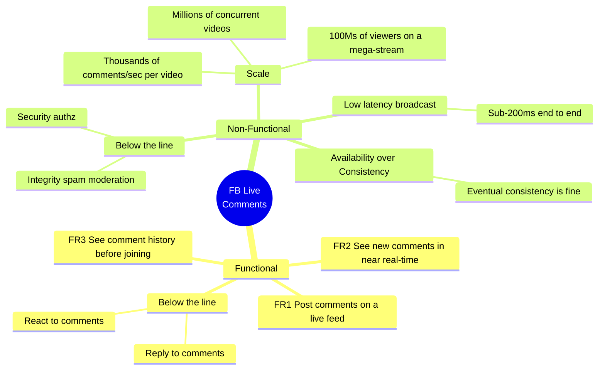
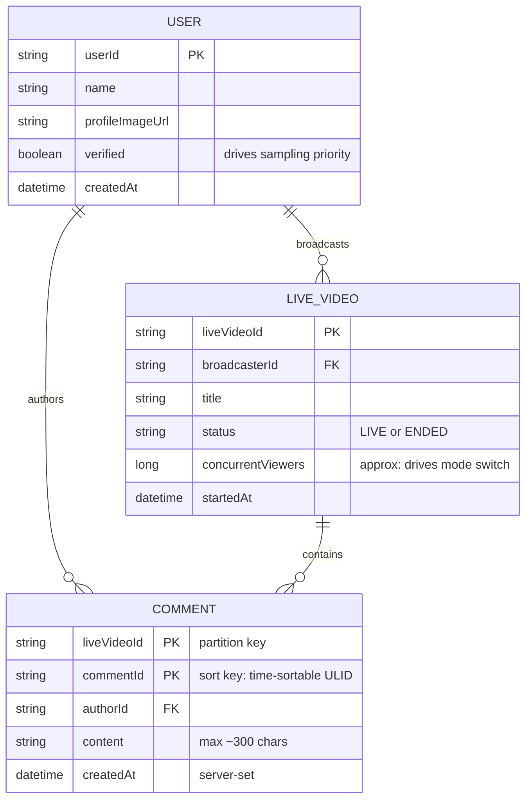
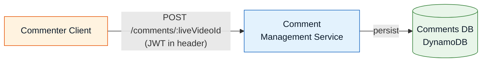
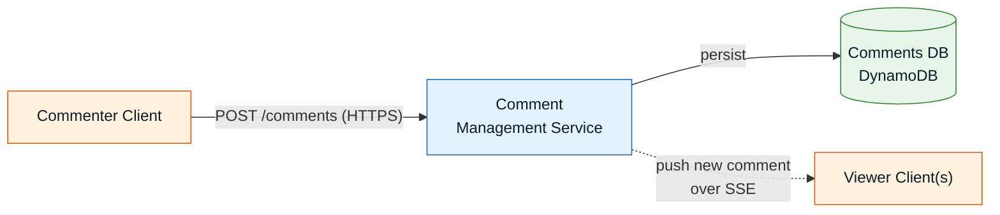
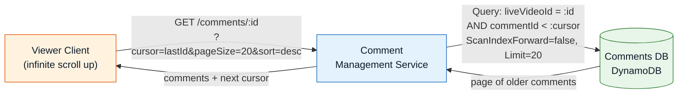
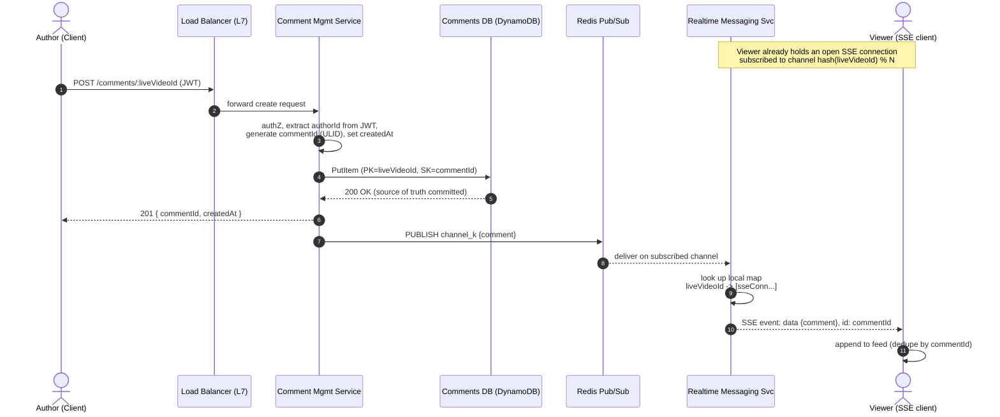
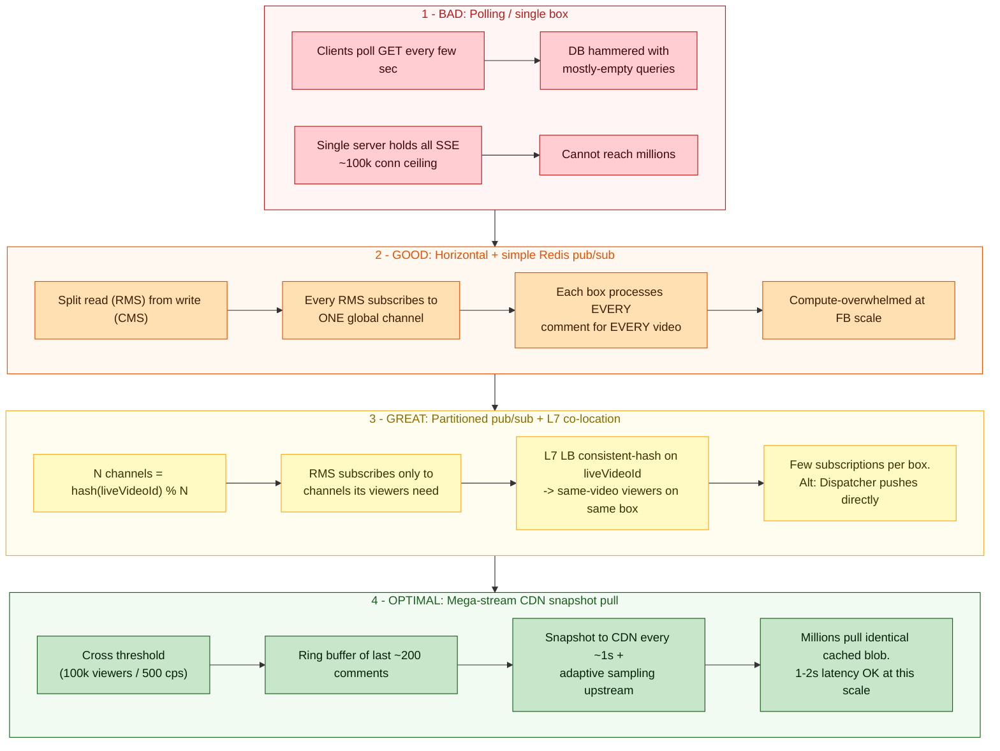
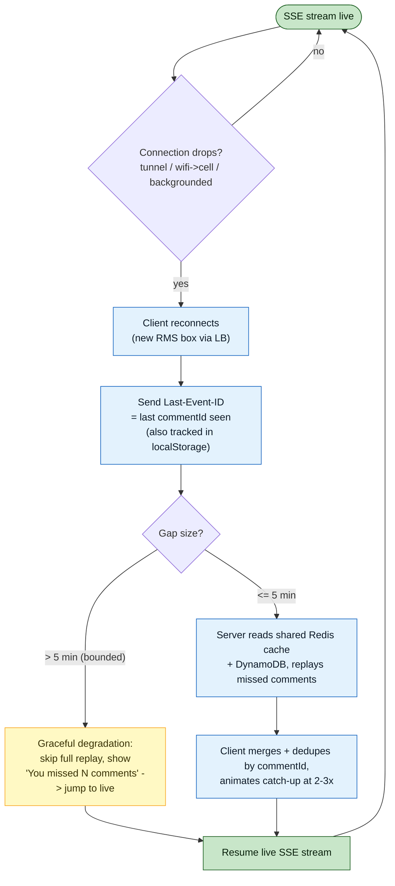
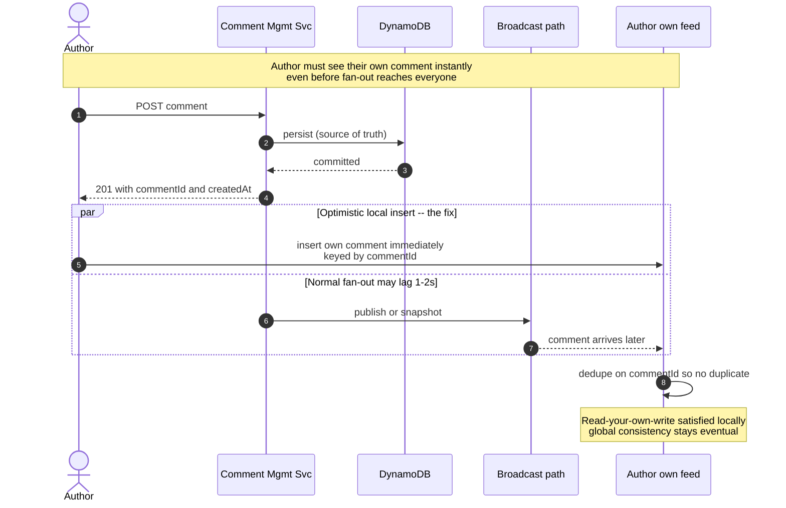

# Facebook Live Comments — System Design Notes (SDE-2 / Staff prep)

> **The one-line framing.** This is a *real-time fan-out* problem with an extreme
> read/write imbalance and a long tail that goes fully non-linear at mega-stream
> scale. The interesting engineering is *not* "store a comment" — it's "broadcast
> one write to millions of readers in <200ms, and then admit that at the very top
> of the scale distribution the requirements themselves change." The candidate who
> only builds the SSE fan-out passes as senior; the candidate who recognizes the
> **requirements break at the tail and switches delivery models** reads as staff.

---

## 1. Requirements

### Functional (above the line)

1. **FR1 — Post a comment** on a live video feed.
2. **FR2 — See new comments in near-real-time** while watching.
3. **FR3 — See comment history** (comments posted before the viewer joined), via infinite scroll.

**Below the line (explicitly out of scope):** replying to comments, reacting to comments.

### Non-functional (above the line)

1. **Massive scale** — millions of concurrent *videos*, thousands of comments/sec *per video*, and on a mega-stream (World Cup final) hundreds of millions of concurrent *viewers* on a single video.
2. **Availability > Consistency** — eventual consistency is fine. It is acceptable for two viewers to briefly see comments in a slightly different order or with slightly different membership; it is *not* acceptable for the feed to go down.
3. **Low-latency broadcast** — sub-200ms end-to-end under typical network conditions. (200ms is the human threshold below which an interaction is perceived as instantaneous.)

**Below the line:** security/authorization, content integrity (spam, hate-speech moderation).

### NFR → deep-dive map (state this explicitly; it structures the whole interview)

| Non-functional requirement | Drives which deep dive |
|---|---|
| Low-latency broadcast (<200ms) | **DD1** — Real-time delivery: polling → WebSockets → SSE |
| Scale to millions of viewers | **DD2** — Horizontal scaling & server coordination, then **mega-stream** offload (the hardest deep dive) |
| Availability > consistency | Fire-and-forget pub/sub + **DD3** — disconnection & catch-up (persist-then-broadcast, bounded replay) |



---

## 2. Core entities

Three nouns. Note the value-add: the notes stop at "User / Live Video / Comment" — the actual **key design is what makes or breaks the pagination deep dive**, so we pin it down now.

- **User** — a viewer or a broadcaster. `verified` matters later (sampling priority on mega-streams).
- **Live Video** — owned by a *different team*; we integrate with it (read `status`, `concurrentViewers`). We don't own the video pipeline.
- **Comment** — the message. This is the only entity we actually *write* at high volume.

### Schemas (the notes abstract these away — here they are)

**Comment table (DynamoDB).** The single most important decision is the key schema, because it must simultaneously support (a) colocating all comments for a video, and (b) an efficient, *stable* cursor query for history.

- **Partition key: `liveVideoId`** — colocates every comment for one video in one logical partition; a single `Query` returns them.
- **Sort key: `commentId`** — and critically, `commentId` must be **time-sortable** (see the ID note below), so lexicographic order on the sort key *is* chronological order.

> **Correcting the source notes.** The whiteboard sketch labels the schema as
> `commentId (PK), videoId (shard), createdAt (SK)`. That is internally
> inconsistent with the query the same notes give
> (`liveVideoId = :id AND commentId < :cursor`, `ScanIndexForward=false`). For
> that query to run, `liveVideoId` **is** the partition key and `commentId` **is**
> the sort key. You cannot range-scan on `commentId` if it's the partition key.
> I've corrected it to the schema that actually satisfies the access pattern.

```
Comment
  liveVideoId   (Partition Key)        // "shard" the sketch means partition key
  commentId     (Sort Key)             // time-sortable ULID/Snowflake
  authorId                             // FK -> User; taken from JWT, never the body
  content                              // sanitized, length-capped (~300 chars)
  createdAt                            // server-generated timestamp
```

**Why a time-sortable ID (ULID / Twitter Snowflake) instead of a random UUID or a `createdAt` sort key?**
- A **Snowflake ID** (originated at Twitter to generate roughly-ordered 64-bit IDs across many machines without coordination) packs a timestamp in the high bits, so IDs sort chronologically *and* are unique across writers.
- Sorting by `commentId` rather than `createdAt` avoids the classic bug where two comments share a millisecond timestamp and the cursor query skips or duplicates one. The ID is a **total order**; a wall-clock timestamp is not.
- It makes the cursor **opaque and monotonic**: "everything before `commentId X`" is a clean, index-friendly range with no tie-breaking logic.



---

## 3. API design (with the security notes that separate senior from staff)

### Post a comment

```
POST /comments/:liveVideoId
Authorization: Bearer <JWT>          # session/JWT — NOT the userId in the body
Idempotency-Key: <client-uuid>       # dedupe retries of an optimistic post
Content-Type: application/json

{ "content": "Cool video!" }

201 Created
{ "commentId": "01J...ULID", "createdAt": "2026-09-03T...Z" }
```

**Security / trust rules — say these out loud:**
- **`authorId` comes from the JWT/session, never the request body.** Trusting a body-supplied `userId` lets any client impersonate anyone. The server extracts identity from the validated token.
- **The server generates `commentId` and `createdAt`.** Never trust client timestamps — a malicious client could backdate a comment to jump the ordering, or forge an ID to collide with someone else's. Server-authoritative IDs also give us the total order pagination relies on.
- **Content is validated and sanitized server-side** (length cap, strip/escape markup) before persistence.
- **Idempotency key** protects the optimistic-UI flow: the client renders its comment immediately, so a network retry must not create duplicates.
- **Per-user, per-video rate limiting** — a spam floor that also protects the write path from a single abusive client.

### Fetch history (cursor pagination)

```
GET /comments/:liveVideoId?cursor=<lastCommentId>&pageSize=20&sort=desc
```

### Real-time stream (SSE) and explicit catch-up

```
GET /comments/:liveVideoId/stream          # text/event-stream (SSE)
Last-Event-ID: <lastCommentId>             # replay-on-reconnect (browser sends automatically)

GET /comments/:liveVideoId?since=<lastCommentId>&limit=100   # explicit HTTP catch-up
```

---

## 4. High-level design — built incrementally, one FR at a time

### Step 1 — FR1: viewers can post a comment

The simplest possible path. Client → **Comment Management Service** (authZ, ID generation) → **Comments DB (DynamoDB)**.

- **Why DynamoDB?** Comments are simple, relationship-free records with a massive write rate and no need for cross-row transactions — exactly DynamoDB's sweet spot (single-digit-ms writes, horizontal partitioning, high availability). Postgres/MySQL would also work at moderate scale, but you'd fight partitioning and connection limits at the top end.



### Step 2 — FR2: viewers see new comments in near-real-time

The naive first move is **polling** (`GET ...?since=<lastId>` every few seconds). State it, then immediately reject it: to hit "near real-time" you'd have to poll every few ms, and since most polls return *nothing*, you burn the database on empty queries that scale with viewer count. We need the server to **push**. For now, sketch a push edge (SSE) from the Comment Management Service to viewers; DD1 justifies *why* SSE.



### Step 3 — FR3: viewers see history (infinite scroll up)

Load the most-recent N comments on join, then page **older** as the user scrolls up. This is **cursor pagination**, not offset pagination.

- **Offset pagination is wrong here** for two reasons: (1) the DB counts through every preceding row per page → slower as volume grows; (2) it's **unstable** — a comment inserted while the user scrolls shifts every offset, so they see duplicates or gaps. In a feed that grows thousands/sec, offsets are meaningless within a second.
- **Cursor pagination** points at a specific `commentId` and asks for "the N comments before it." It's O(page) not O(offset), and it's **stable** under concurrent inserts because the cursor identifies an item, not a position.

```
DynamoDB Query:
  KeyConditionExpression: "liveVideoId = :id AND commentId < :cursor"
  ScanIndexForward: false        # newest-first
  Limit: pageSize
```



### The happy path, end to end



---

## 5. Deep dives

### DD1 — Real-time delivery: polling → WebSockets → SSE

| Stage | Approach | Why we move on |
|---|---|---|
| **Bad** | **Polling** every few seconds | Doesn't hit near-real-time without polling every few ms; most polls are empty; DB load scales with viewers, not with comment rate. |
| **Good** | **WebSockets** (RFC 6455, full-duplex) | Great for *balanced* read/write chat. But here the ratio is wildly read-heavy: ~everyone reads, ~few write. Paying for a bidirectional, stateful socket per idle viewer is wasteful. |
| **Great** | **Server-Sent Events (SSE)** | **The right fit.** SSE (part of the HTML5 spec, exposed via the browser `EventSource` API) is a *one-way*, server→client push over plain HTTP. Writes stay ordinary HTTP `POST`s; the frequent reads get an efficient unidirectional stream. Bonus: SSE has **built-in reconnection** via `Last-Event-ID` (used in DD3). |

**SSE's real costs (name them):** some proxies/load balancers buffer streaming responses (breaks SSE — you need an L7 LB configured for it); browsers cap concurrent SSE connections per domain (hurts users watching multiple lives); long-lived connections complicate monitoring/deploys (every deploy drops millions of connections that all reconnect at once — a thundering herd you must jitter).

### DD2 — Scaling to millions (the hardest deep dive)

This is the diagram to get right. Two sub-problems: **coordination** across servers, then the **mega-stream** tail.



**Part 1 — server coordination.** A single box tops out around ~100k SSE connections (bounded by CPU, memory, and file descriptors — *not* the 65,535 port myth; a TCP connection is keyed by the 4-tuple src-ip/src-port/dst-ip/dst-port, so one listening port handles hundreds of thousands of connections). So we scale horizontally into a **Realtime Messaging Service (RMS)** tier, separated from the write-path **Comment Management Service** so each scales independently. Now the problem: viewers of the same video land on different RMS boxes; how do all boxes learn about a new comment?

- **Simple pub/sub (good, then bad):** CMS publishes each comment to one Redis channel; every RMS subscribes. Correct, but every box processes *every* comment for *every* video → compute meltdown at FB scale.
- **Partitioned pub/sub + L7 co-location (great):** hash the stream into `N` channels via `hash(liveVideoId) % N` (a channel-per-video is infeasible — Kafka especially hates unbounded topics). Each RMS subscribes only to the channels its viewers actually need. Then make an **L7 load balancer (NGINX/Envoy) consistent-hash on `liveVideoId`** so all viewers of one video co-locate on the same box → far fewer subscriptions per server. Cost: coordinating subscription churn as viewer composition and the fleet change.
- **Dispatcher service (alternative great):** invert pub/sub. A **Dispatcher** holds a live map of *which RMS boxes serve which videos* (kept fresh via heartbeats/registration through **Zookeeper/etcd**, which give you consensus — ZAB/Raft — for a consistent shared view). CMS asks the Dispatcher "who has viewers for this video?" and pushes the comment straight there over HTTP. Centralizes routing logic (easy to add load-based routing), eliminates subscription management. Cost: keeping the map accurate during viral spikes; multiple Dispatcher instances need coordinated cache invalidation.

**Redis vs Kafka for the bus:** Redis pub/sub is low-latency and handles **dynamic** subscriptions well (viewers switch videos constantly) — the right default. Its fire-and-forget nature is *fine here* because **DynamoDB is the source of truth**; a missed broadcast is recovered by the catch-up path (DD3). Kafka is durable and hugely scalable but is a poor fit for rapidly-changing subscription patterns.

**Part 2 — mega-streams (the staff-level pivot).** At 5,000 comments/sec, ~20 messages on screen means each comment is visible for ~4ms — no human can read that. The insight: **at the tail, the requirements themselves change.** Users aren't reading a conversation; they're feeling a *crowd vibe*. So:

1. **Adaptive sampling** — sample the stream inversely to velocity (50% at 100 cps, ~1–2% at 5,000 cps) so every viewer gets a readable, roughly-constant rate. Bias the sample toward followed users, verified accounts, and reacted-to comments so the "best" ones survive.
2. **CDN snapshot / pull model (optimal)** — maintain a **ring buffer** of the last ~100–200 comments per mega-stream; snapshot it to Redis/CDN origin every ~1s; the **CDN** fans it out globally from edge caches. Clients **poll the CDN** (~1s) and *animate* the new comments smoothly across the interval to fake a continuous stream. This reuses infrastructure whose entire job is serving identical content to millions — a comment snapshot is just another cacheable blob. **Flip SSE→CDN automatically** above a threshold (e.g. 100k viewers or 500 cps), with **hysteresis** so viewership hovering at the cutoff doesn't flap between modes. Trade-off: 1–2s latency instead of <200ms — acceptable precisely because no one can engage with individual comments at that rate. **Read-your-own-write** is preserved client-side (optimistic local insert; see DD "consistency" below).

### DD3 — Disconnections & catch-up (availability > consistency in practice)

Mobile networks are flaky: tunnels, Wi-Fi↔cellular handoffs, backgrounded apps. Progression:

- **Bad:** do nothing — reconnect and only get *new* comments; the gap is visible and jarring during a big moment.
- **Good:** **SSE `Last-Event-ID`** — every event carries an id (the `commentId`); on auto-reconnect the browser resends the last id it saw, and the server replays everything after it.
- **Great:** client also tracks its position locally (localStorage / app storage) and can request explicit HTTP catch-up (`?since=<lastId>&limit=100`) for UX control — animate the backlog at 2–3× or show "You missed 47 comments → jump to live." **Bound the replay** (e.g. last 5 minutes) with graceful degradation for longer gaps — never dump an hour of stale comments. On mobile, **pre-emptively disconnect on backgrounding** and reconnect on foreground (the OS throttles background connections anyway → battery win).

**The cross-server catch-up wrinkle:** after reconnect the viewer likely hits a *different* RMS box (load balancing), which has no local history. Solution: a **shared Redis cache** of recent comments per video so any box can replay. And since SSE live events may arrive *while* the HTTP catch-up response is in flight, the client **dedupes and merges on `commentId`** to avoid duplicates/gaps.



### DD (consistency) — read-your-own-write without global consistency

We chose availability + eventual consistency, but there's one place a user *demands* to see their own effect instantly: their own comment. The fan-out path (pub/sub, or worse the 1–2s CDN poll) may lag. The fix is **client-side optimistic insertion**: the moment the author's `POST` returns `201 {commentId}`, the client inserts that comment into its own feed locally, keyed by `commentId`. When the same comment later arrives via the broadcast path, the client **dedupes on `commentId`** — no duplicate. Read-your-own-write is satisfied locally; everyone else stays eventually consistent. This is why the server must return the server-generated `commentId` in the create response.



---

## 6. Final design

The final architecture (from the whiteboard): writes go Client → L7 LB → **Comment Management Service** → **DynamoDB**, then out to a **Dispatcher** which routes each comment over HTTP to exactly the **Realtime Messaging Service** boxes holding viewers of that video; viewers hold **SSE** connections established through an L7 LB keyed on `liveVideoId`. (Swap the Dispatcher for partitioned Redis pub/sub + L7 co-location and it's the equally-valid "pub/sub" variant — reach for pub/sub in the interview; it has fewer corner cases.) On mega-streams, the SSE fan-out is bypassed entirely in favor of the CDN snapshot pull model.


---

## 7. What each level is expected to produce

- **Mid-level (SDE-1/2):** correct happy path — post → persist to DynamoDB → move off polling to a push model (SSE) → cursor pagination for history. Gets one server working end to end.
- **Senior:** horizontal scaling of the SSE tier, the **coordination problem** solved with pub/sub, L7 co-location via consistent hashing, cursor-pagination correctness/stability, SSE `Last-Event-ID` reconnection, persist-then-broadcast with DynamoDB as source of truth.
- **Staff:** recognizes the **requirements change at the tail** — pivots mega-streams to sampling + **CDN snapshot pull**, argues the latency trade-off, adds **hysteresis** on the mode switch, handles **read-your-own-write** with optimistic client insertion, reasons crisply about **Redis-vs-Kafka** for dynamic subscriptions, and calls out operational realities (deploy-time connection storms, write hot-partitions — see Q&A).

---

## 8. Trade-off cheat sheet

| Decision | Choice | Because | You'd reconsider if… |
|---|---|---|---|
| Delivery transport | **SSE** | One-way, HTTP-native, read-heavy fit, built-in reconnect | Symmetric read/write (real chat) → WebSockets |
| Datastore | **DynamoDB** | Simple records, huge write rate, no joins/txns, HA | Rich relational queries / strong txns needed → Postgres |
| Comment ID | **Time-sortable (ULID/Snowflake)** | Total order → stable cursor, no timestamp ties | Don't need ordered pagination → UUIDv4 fine |
| Pagination | **Cursor** | O(page), stable under concurrent inserts | Tiny/static dataset → offset is simpler |
| Message bus | **Redis pub/sub** | Low latency, dynamic subs, fire-and-forget OK (DB is truth) | Need durable replay / audit → Kafka |
| Coordination | **Pub/sub + L7 co-location** (or Dispatcher) | Fewer subs/box; pub/sub has fewer corner cases | Want centralized, load-aware routing → Dispatcher + etcd |
| Mega-stream delivery | **CDN snapshot pull** | Reuses edge fan-out; humans can't read the tail anyway | Every comment must be delivered <200ms (not this domain) |
| Consistency | **Eventual + optimistic RYOW** | Availability > consistency; author sees own write locally | Ordering must be globally identical → single-writer sequencer |

---

## 9. Mock interview — staff-level curveballs

**Q1. A user posts a comment, gets a 200, but their *own* feed never shows it while everyone else sees it. What happened, and how do you fix it?**
Their SSE connection is on an RMS box that either isn't subscribed to that video's channel yet or missed the fire-and-forget publish; on a mega-stream, their next CDN poll is up to a second away. Fix: **optimistic local insertion** — on `201 {commentId}`, insert into the author's own feed immediately and dedupe by `commentId` when the broadcast copy arrives.
*Design tweak it forces:* the create response must return the **server-generated `commentId`**, and the client feed must be a **`commentId`-keyed set**, not an append-only list.

**Q2. Redis pub/sub is fire-and-forget — isn't that a data-loss risk for comments?**
No, because we **persist to DynamoDB first, then broadcast**. The broadcast is a best-effort accelerator, not the system of record. A dropped message is recovered by the reconnect/catch-up path reading from DB (or the shared Redis history cache).
*Tweak it forces:* strict **persist-then-publish ordering**, and a **bounded replay** window backed by a shared cache so any RMS box can serve catch-up.

**Q3. A celebrity's single stream drives thousands of writes/sec to one `liveVideoId`. Doesn't that hot-partition DynamoDB?**
Yes — one partition key = one physical partition = a write hotspot that throttles. Introduce **write sharding**: composite partition key `liveVideoId#bucket` where `bucket ∈ [0, M)` chosen per write (random/round-robin). Writes scatter across `M` partitions; the history read queries all `M` buckets and **merge-sorts by `commentId`**.
*Tweak it forces:* fan-out read across `M` sub-partitions + client/server merge; pick `M` per-video based on `concurrentViewers`/comment rate, not globally.

**Q4. Your L7 consistent-hashing co-locates all of one video's viewers on one box for subscription efficiency — but for a mega-stream that same box now has to hold millions of SSE connections. Isn't co-location self-defeating at the top end?**
Exactly — co-location optimizes the *coordination* problem but concentrates load, which breaks for mega-streams. That's *why* mega-streams **exit the per-connection model entirely** and move to CDN snapshot pull, where no single box holds the viewers at all.
*Tweak it forces:* the **mode-switch threshold** and **hysteresis**; co-location is the strategy for the body of the distribution, CDN for the tail.

**Q5. How do you guarantee all viewers see comments in the same order?**
You don't guarantee a *global* order cheaply, and the NFRs don't require it (availability > consistency). We get a stable **per-video order via `commentId`** (time-sortable, server-assigned). If IDs are generated on multiple CMS instances, clock skew can reorder near-simultaneous comments by a few ms — acceptable here. If an interviewer insists on a strict total order, route a video's writes through a **single sequencer/partition** that assigns a monotonic sequence number — at the cost of that video's write throughput.
*Tweak it forces:* choosing between **cheap-and-eventual** (ULID per instance) and **strict-and-serialized** (per-video sequencer) — a throughput-vs-ordering trade.

**Q6. Every deploy of the RMS tier drops millions of SSE connections that all reconnect at once. How do you survive it?**
That's a thundering-herd/self-DDoS. Mitigations: **jittered reconnect** (client backoff with randomization), **connection draining** on rolling deploys (stop new connections, let old ones bleed off), capacity headroom for reconnect spikes, and leaning on the **catch-up path** so a reconnect is cheap (send `Last-Event-ID`, get a bounded replay).
*Tweak it forces:* client reconnect must be **jittered + catch-up-aware**, and deploys must be **rolling with draining**, not all-at-once.

**Q7. Cost: you're paying for millions of idle open connections on streams nobody's actively commenting on. How do you cut that?**
Push low-engagement/high-scale streams to the **CDN pull model** (no persistent connections), **disconnect backgrounded mobile clients**, and multiplex multiple lightweight lives over fewer connections where possible. The threshold that flips SSE→CDN is as much a **cost lever** as a scale lever.
*Tweak it forces:* the mode threshold becomes a tuned cost/latency knob, not a fixed constant — and mega-stream economics justify the CDN path even before you hit the hard scale ceiling.
