# Uber System Design — Staff-Level Interview Guide

> Ride-hailing platform: match on-demand riders with nearby drivers. This guide walks the full flow, then goes deep on the six areas that actually decide the interview — geospatial search, write throughput, matching consistency, request durability, driver timeouts, and scaling — with **bad → good → great → optimal** progressions, schemas, trade-offs, and a diagram at every step.

---

## 1. Requirements

### Functional (pick the top 3 — everything else is "below the line")
1. Rider inputs start + destination → gets a **fare estimate**.
2. Rider **requests a ride** based on that estimate.
3. Rider is **matched with a nearby, available driver**; driver can **accept/decline** and navigate to pickup/drop-off.

**Below the line (state them, then park them):** ratings, scheduled rides, ride categories (X / XL / Comfort), driver→rider ratings.

> Naming out-of-scope items shows product thinking and lets the interviewer pull one "above the line" if they want to see it. It's a nice-to-have — don't burn time inventing them.

### Non-Functional (these drive every deep dive)
1. **Low-latency matching** — match or fail in **< 1 minute**.
2. **Strong consistency in matching** — a driver is never assigned two rides at once; a ride is offered to one driver at a time.
3. **High throughput / surge tolerance** — handle spikes (e.g. 100k requests from one location: concert let-out, NYE).

**Below the line:** GDPR/privacy, fault tolerance & failover, monitoring/alerting, CI/CD.

> The mapping to remember: **NFR #1 → geospatial search + location writes**, **NFR #2 → distributed locking**, **NFR #3 → queueing + durable execution**. When you hit deep dives, you're just cashing in these NFRs.

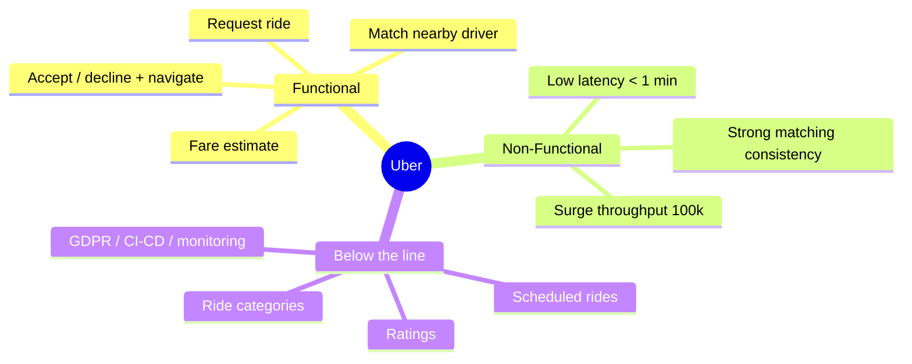

---

## 2. Core Entities & Schemas

Start broad, then attach fields. Talk through them with the interviewer before moving to the API.

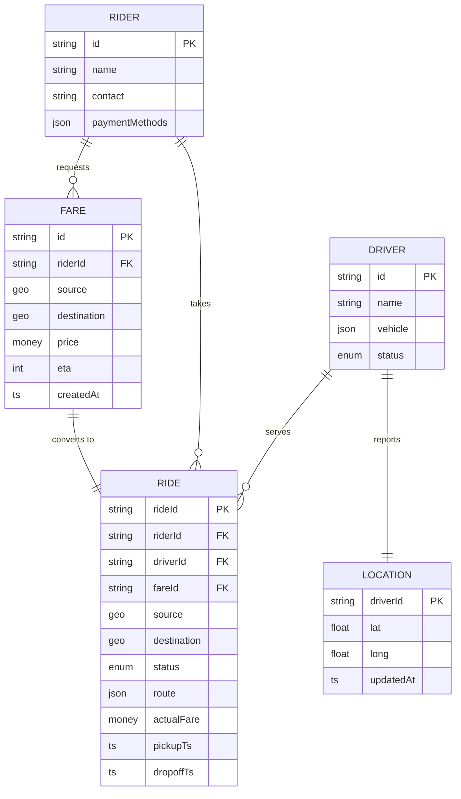

`RIDE.status`: `requested | matching | accepted | en_route | in_progress | completed | cancelled`.

> **Why Fare is a separate entity:** you re-price at request time from a trusted server-side record. It also cleanly separates "quote" (ephemeral, high volume, most never convert) from "trip" (durable, billed). No wrong answer — just justify it.

---

## 3. API Design

```
POST /fare              -> Fare
  body: { pickupLocation, destination }

POST /rides             -> Ride
  body: { fareId }                    // NOT the price — server re-reads it

POST /drivers/location  -> Success/Error
  body: { lat, long }                 // driverId comes from JWT, never the body

PATCH /rides/:rideId    -> Ride
  body: { accept | deny }
```

### Security — a real signal at Uber
Never trust anything the client can forge:
- **Identity** (`userId`, `driverId`) → read from the **session/JWT**, never the body or path.
- **Timestamps** → generated **server-side**.
- **`fareEstimate`** → looked up from the DB via `fareId`. If the client passes the price, a rider can rewrite their own fare. Classic red-flag answer to avoid.

`POST` (not `GET`) for `/fare` because we persist a Fare entity. `PATCH` for accept/decline because we mutate an existing Ride.

---

## 4. High-Level Design (build it one functional requirement at a time)

### FR1 — Fare estimate

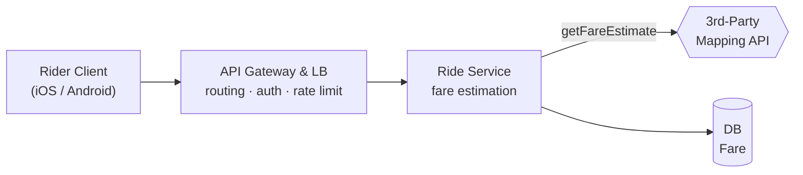

- **API Gateway / LB:** routing, auth, rate limiting.
- **Ride Service:** calls the mapping API for distance + travel time, applies the pricing model (abstract it away), writes a Fare, returns it.
- **Mapping API:** Google Maps or similar for distance/ETA.

### FR2 — Request a ride

No new services — add a **Ride** table. On `POST /rides`, Ride Service reads the Fare by `fareId`, creates a Ride with status `requested`, and triggers matching.

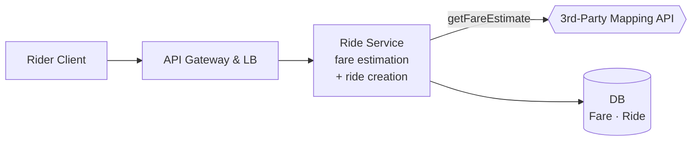

### FR3 — Match a nearby driver

Add **Driver Client**, **Location Service**, **Ride Matching Service**. Drivers continuously stream location; matching queries the freshest positions for the closest available drivers.

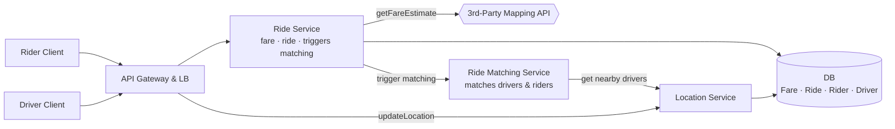

### FR4 — Accept/decline + navigate

Add a **Notification Service** (APNs / FCM) to push the offer to the top-ranked driver. Driver `PATCH`es accept → Ride Service sets `accepted`, assigns `driverId`, returns pickup coords; client GPS navigates. On decline, the offer cascades to the next driver.

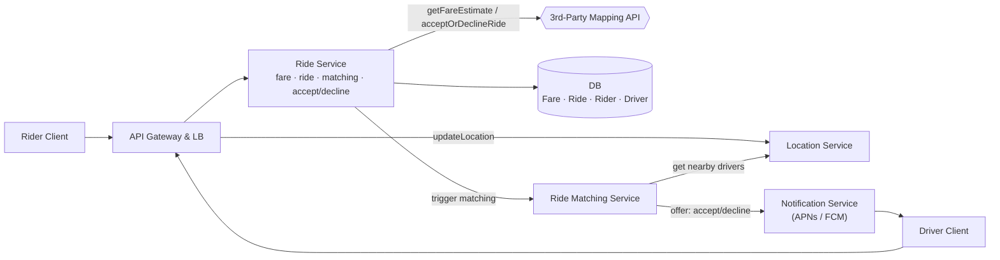

> **Real-time delivery pattern:** pushing offers to drivers is a realtime problem. Options: long-poll → SSE → **WebSockets**. WebSockets (or a push service) fit the bidirectional, low-latency offer/response loop best.

### Full happy-path sequence (rider taps → trip)

End-to-end flow with every component in play — this is a great thing to narrate top-to-bottom in the interview to prove the pieces connect.

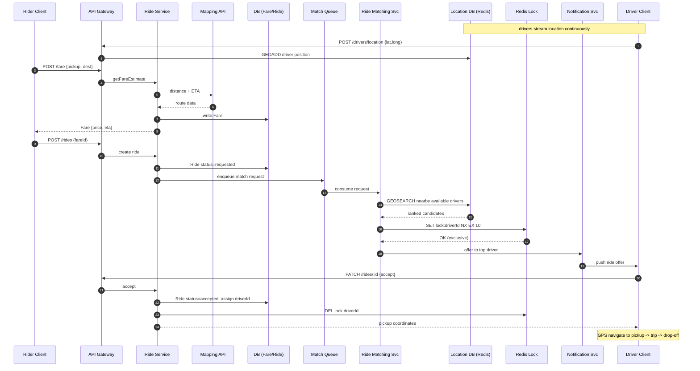

---

## 5. Deep Dives (where the interview is won)

### Deep Dive 1 — Geospatial: high-frequency writes + efficient proximity search

**Two problems:**
- **Writes:** ~10M drivers pinging every ~5s ≈ **2M writes/sec**. On DynamoDB on-demand (~$1.25/M WRUs, ~100-byte items) that's **>$200k/day** — and a relational primary would fall over.
- **Reads:** naïvely finding nearby drivers means scanning every driver and computing distance — **O(n)** per request. A B-tree on `lat` and `long` separately doesn't help: B-trees are 1-D, so you range-scan latitude but still linearly scan all of those for longitude.

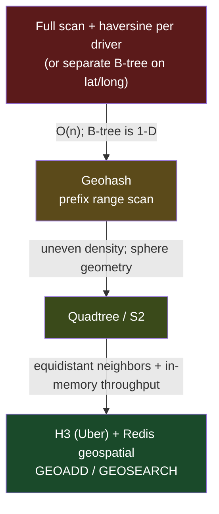

| Level | Approach | Why |
|---|---|---|
| **Bad** | Full-table scan + haversine; or separate B-tree indexes on lat/long | O(n) reads; B-trees are one-dimensional and can't partition 2-D space. |
| **Good** | **Geohash** (encode lat/long into a prefix; nearby points share prefixes), query by prefix | Turns proximity into a prefix range scan. Simple, well-supported. |
| **Great** | **Quadtree** (recursively split space into 4; dense cells subdivide deeper) or **S2** (Hilbert curve maps the sphere to 1-D cells) | Adapts to uneven density; handles sphere geometry correctly. |
| **Optimal** | **H3** (Uber's hexagonal grid) for indexing **+ Redis geospatial** as the store | H3 hexagons have **uniform neighbor distance** (unlike squares, where diagonal neighbors are farther) → cleaner radius queries and surge zones. Redis is in-memory (absorbs 2M writes/s) and its geo commands are geohash-backed sorted sets (fast reads). **One store solves both problems.** |

> **Staff move:** name-drop **H3 as Uber's own tech**, explain *why hexagons* (equidistant neighbors → better radius search + surge tiling), then close the loop: the write-throughput fix and the read-efficiency fix are the *same decision* — location lives in Redis, not the durable DB.

### Deep Dive 2 — Taming location-update overload

Fix it at the **client**, not just the server.

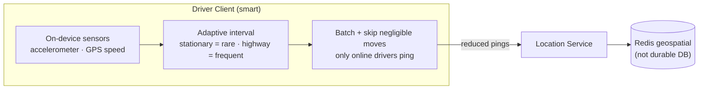

| Level | Approach |
|---|---|
| **Bad** | Fixed 5s ping from every driver → durable DB write |
| **Good** | Write to **Redis**, not the durable DB (no need to persist every historical position) |
| **Great** | **Adaptive ping intervals on-device**; **batch** updates; only **online/available** drivers ping; skip negligible movement |

> Don't draw the client as a dumb box. Client-side logic (adaptive sampling here; chunking/compression in a file-upload design) is often where scalability is bought.

### Deep Dive 3 — Consistency: no double-offers, no double-assignment

Offer to **one driver at a time**; a driver holds **at most one outstanding offer**; ~10s accept window. **This is the Ticketmaster seat-reservation problem** — exclusive reservation for a bounded time, then release.

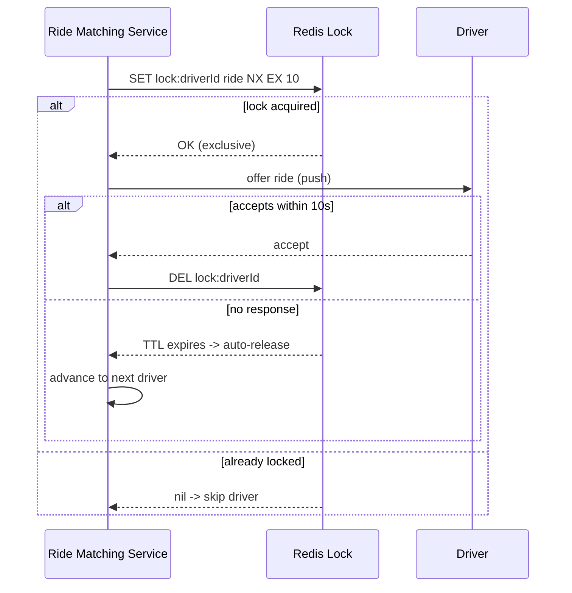

| Level | Approach | Why |
|---|---|---|
| **Bad** | No coordination | Races: one ride to many drivers, or one driver flooded |
| **Good** | Conditional DB write on a driver `status` field | Works, but DB row locks are contended and slow on the hot path |
| **Optimal** | **Distributed lock in Redis with TTL** — `SET lock:driverId ride NX EX 10` | `NX` = single owner; **`EX 10` auto-releases if the driver ghosts**, so the timeout is handled *by the lock itself*. |

> The TTL is the elegant part: the accept-window and the timeout-recovery are the same mechanism.

### Deep Dive 4 — No dropped requests under peak / on crash

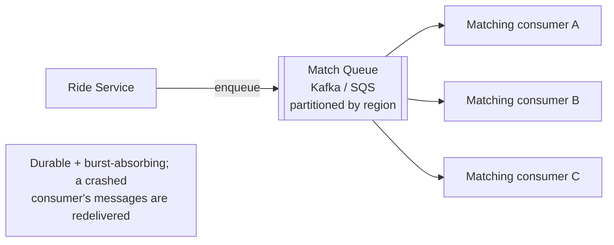

| Level | Approach | Why |
|---|---|---|
| **Bad** | Matching holds the request in memory, synchronously | Bursts overflow; a crash drops the ride |
| **Good** | Durable **queue (Kafka / SQS)**; matching consumes | Decouples ingest from processing, absorbs bursts, gives retry + durability. In-memory queue is *not* enough. |
| **Great** | **Partition by region/geohash**; consumer groups scale per hotspot | Localizes matching, bounds search space, scales with demand |

### Deep Dive 5 — Driver fails to respond (human-in-the-loop)

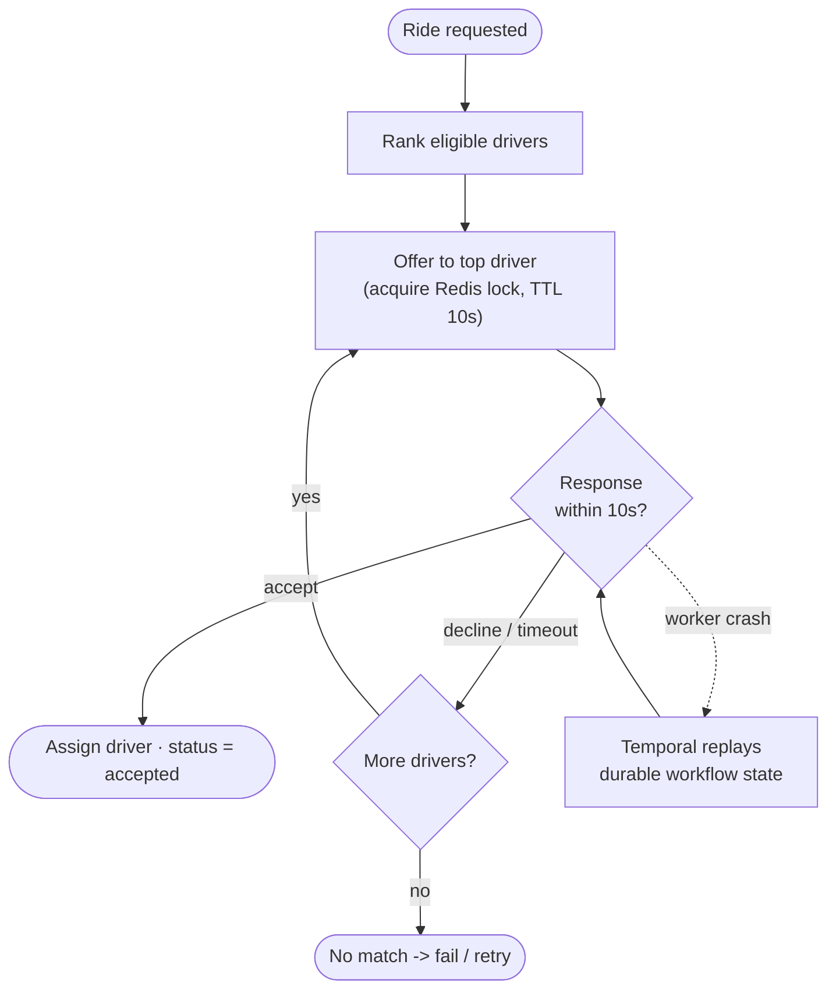

| Level | Approach | Why |
|---|---|---|
| **Good** | Redis lock TTL frees the ghosting driver after 10s | But *something* must advance to the next driver — a bare TTL doesn't drive the loop |
| **Optimal** | **Durable execution — Temporal (originally Uber's Cadence)** | Models *offer → await ≤10s → on-timeout advance → repeat*; persists workflow state and **replays on worker crash**, so timers and progress survive failures |

> **Staff signal:** Uber literally built **Cadence** (→ Temporal) for this class of durable, timer-driven, human-in-the-loop workflow. Citing it shows you know the pattern *and* its origin.

### Deep Dive 6 — Scaling further (latency + throughput)

- **Geo-sharding:** shard location (Redis) and matching by city/region; match within a region → smaller search space, natural horizontal scale.
- **Read replicas** for the Ride/Fare durable DB (read-heavy status lookups).
- **Stateless services** behind the gateway → scale matching/location/ride tiers independently.
- Keep the **hot path in memory** (Redis: locations + locks); reserve the durable DB (DynamoDB or Postgres) for records that must survive.

---

## 6. Final Design

The complete architecture after applying the "great/optimal" solutions:

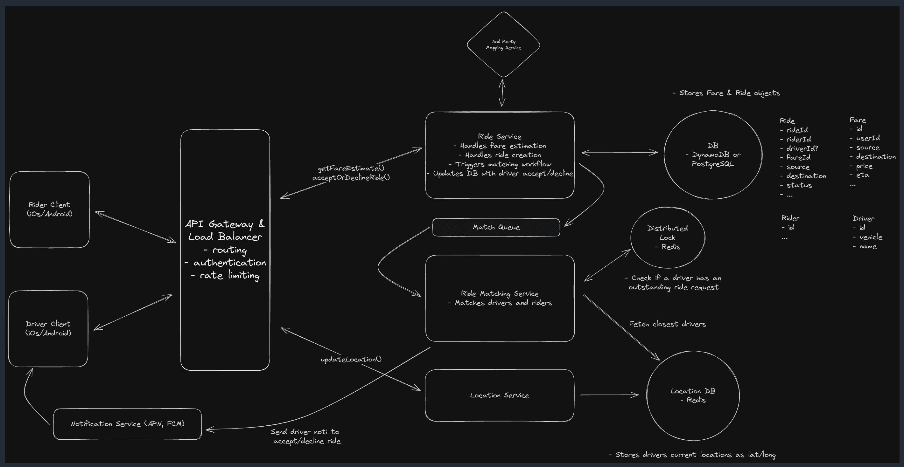

**Reading the diagram:**
- **Rider / Driver Clients** → **API Gateway & LB** (routing, auth, rate limiting).
- **Ride Service** — fare estimation, ride creation, triggers matching, updates DB on accept/decline; talks to the **3rd-Party Mapping Service** and the durable **DB** (DynamoDB or PostgreSQL) holding **Fare · Ride · Rider · Driver**.
- **Match Queue** buffers requests into the **Ride Matching Service** (durability + surge absorption).
- **Ride Matching Service** → **Distributed Lock (Redis)** to check a driver has no outstanding offer, and **Location DB (Redis)** to fetch closest drivers (lat/long).
- **Location Service** ingests `updateLocation()` pings into the Redis Location DB.
- **Notification Service (APNs / FCM)** pushes accept/decline offers to the Driver Client.

Text fallback:

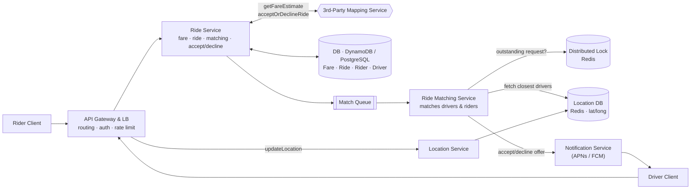

---

## 7. What's Expected By Level

- **Mid (E4):** ~80% breadth / 20% depth. Clean API + data model, functional HLD, recognizes the need for *a* spatial index (may not name one), lands the "good" locking solution.
- **Senior (E5):** ~60/40. Speeds through HLD; goes deep on **≥2 of**: geospatial search, matching lock, request queueing. Articulates trade-offs; sharding/replication OK with hints.
- **Staff+:** ~40/60. Deep on **3+ areas**, proactive ("looks around corners"), practical tech grounded in experience. Bar: the interviewer *learns something*. Own the direction; they intervene only to focus.

---

## 8. Trade-off Cheat Sheet

- **Redis for location, not DynamoDB/Postgres** → in-memory absorbs 2M writes/s and serves geo-queries; durable DB would cost >$200k/day and still be slow for proximity. Trade: volatility (fine — positions are ephemeral).
- **H3 (hexagons) over geohash squares** → equidistant neighbors → cleaner radius/surge. Trade: more complex than a raw geohash prefix.
- **Distributed lock (Redis TTL) over DB row lock** → fast, and TTL doubles as the accept-timeout. Trade: expiry/clock edge cases to reason about.
- **Kafka/SQS queue over synchronous matching** → durability + burst tolerance; region-partitioned for scale. Trade: added latency + operational surface.
- **Temporal over ad-hoc timers** → survives crashes, models human-in-the-loop cleanly. Trade: a heavy dependency to run.
- **WebSockets/push over polling** for driver offers → low-latency bidirectional. Trade: connection state to manage at scale.

---

## 9. Quiz Note

"Which data structure efficiently partitions 2-D space for proximity searches?" — the three shown (B-tree, linked list, hash table) are all wrong. The intended answer is a Quadtree (spatial tree), the family that includes geohash/S2/H3 indexing. B-trees are one-dimensional; hash tables destroy locality; linked lists have no spatial structure.

10. Mock Interview — Staff-Level Follow-Ups & Tweaks

The core design rarely survives contact with a staff interviewer untouched. These are the curveballs they throw once the happy path is solid — each with a strong answer and the concrete design change it forces.

Q1. "Add surge pricing. How does it flow through the system?"

Compute a demand/supply ratio per H3 cell over a short sliding window: open ride requests (demand) vs available drivers in the cell (supply). A Pricing Service multiplies the base fare by the cell's current multiplier. Tweak: add a stream aggregation (Flink / Kafka Streams) over the location + request streams keyed by H3 cell; write multipliers to Redis with a short TTL; the fare estimate reads the multiplier at quote time. Critical consistency point: freeze the quoted multiplier into the Fare record so the rider is charged exactly what they were shown — never recompute price at charge time.

Q2. "Greedy nearest-driver is locally optimal, not globally. Do better."

Switch from instant per-request matching to batch matching: buffer requests over a 1–2s window per region and solve a min-cost bipartite assignment (Hungarian algorithm) to minimize total pickup ETA and reduce driver deadheading across the whole batch. Tweak: the Match Queue already buffers — add a windowed batch consumer. Trade-off: you trade a second of match latency (still well under the 1-min SLA) for materially better global efficiency and driver utilization. This is closer to what Uber actually does.

Q3. "Your queue redelivers on crash. Won't a rider get matched twice?"

Make the matching workflow idempotent, keyed by rideId. Before offering, check ride status — if it's already matching/accepted, skip. Temporal gives exactly-once workflow semantics via dedupe on workflowId = rideId, so a redelivered request re-attaches to the existing workflow rather than starting a new one. Tweak: notifications remain at-least-once, so the driver client dedupes by offerId; the accept PATCH is a conditional write on ride version to reject a stale second accept.

Q4. "A driver's phone dies mid-trip. How do you detect it and keep state consistent?"

Heartbeat + TTL: the Redis location entry carries a lastSeen; set a ~30s TTL. A missing heartbeat = treat as offline; GEOSEARCH filters out stale entries. For an in-progress trip, the trip state lives durably in the Ride record, so it survives — you reconcile position when the driver reconnects. Tweak: add a lastSeen filter to matching queries and a background sweeper that flips silent drivers to offline.

Q5. "The ride crosses many services and states. How do you keep the state machine consistent?"

Single source of truth: Ride Service owns the state machine and validates every transition (requested → matching → accepted → en_route → in_progress → completed; illegal jumps rejected). Use optimistic concurrency (a version field / conditional write) so two writers can't both advance it. Other services emit events but never own ride state. Tweak: publish state-change events via the outbox pattern (write event + state in one transaction, relay async) so you never lose an event or dual-write inconsistently.

Q6. "Uber is global. How do you deploy across regions, and why?"

Shard by city/region. Riders and drivers in a city almost never cross regions, so each region is a near-self-contained cell: its own matching, location store, and locks. Route each request to the region owning the pickup location (geo-DNS or gateway routing by geohash prefix). Tweak: this also buys latency (data near users) and data residency / GDPR compliance. Cross-region edge cases (an airport on a border) are handled by having the gateway resolve by pickup cell, not user home region.

Q7. "Redis holds all live locations and the locks — it's in-memory. What happens when it fails over?"

Locations are ephemeral and self-healing: drivers re-ping within seconds, so a replica promotion rebuilds position state quickly; brief matching degradation is acceptable. Run Redis as a replicated cluster (Cluster / Sentinel) for HA. The locks matter more — a lost lock could double-offer, so use a replicated lock (Redlock-style) or accept that the 10s TTL bounds the blast radius. Tweak: separate the location cluster from the lock cluster so their failure domains and scaling profiles are independent.

Q8. "Rider cancels right as the driver accepts. Resolve the race."

Both operations are conditional writes on the ride version. Whichever commits first wins; the loser is rejected and retried against fresh state. On cancel-wins: release the driver (delete the Redis lock, set available). On accept-wins: cancellation becomes a post-acceptance cancel (fee via the payment path). Tweak: model cancellation as an explicit state transition so the workflow can unwind cleanly (unlock driver, optionally re-queue if the driver cancelled and the rider still wants a ride).

Q9. "Walk me through payment at drop-off." (originally below the line — expect it pulled up)

On drop-off, Ride Service computes actualFare (may differ from the estimate due to route/time) and hands off to a Payment Service via a saga: authorize/hold at ride start, capture at completion, with a durable ledger and idempotency keys on every charge so retries don't double-bill. Tweak: payment failures shouldn't block trip completion — settle asynchronously and reconcile, flagging failed captures for retry rather than holding the driver.